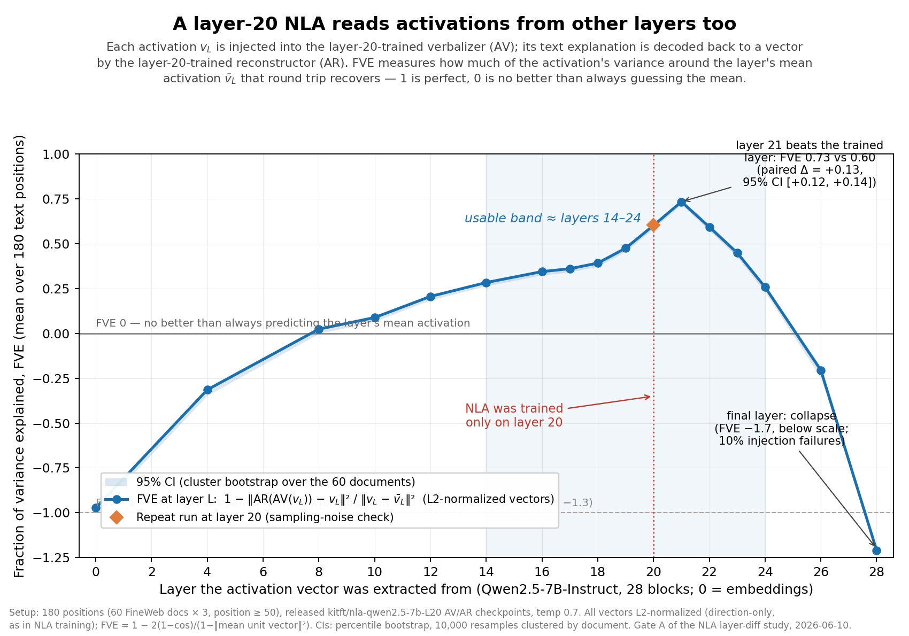

# Gate A — cross-layer transfer of the released Qwen-7B L20 NLA

First feasibility gate for a **layer-diff NLA** variant (verbalize
`h_Y − h_X` instead of raw activations). Full write-up: [REPORT.md](REPORT.md).
Result: **passed** — the L20 NLA round-trips activations from layers ~14–24,
with L21 scoring *higher* than the trained layer (FVE 0.73 vs 0.60; cos 0.90 vs 0.855).



## Contents

| file | what |
|---|---|
| `REPORT.md` | full write-up: motivation, design, results, incidents |
| `gate_a_transfer.png` | the transfer curve above |
| `gate_a.py` | pipeline: `extract` / `generate` / `score` subcommands |
| `run.sh`, `run2.sh` | pod drivers (downloads → extract → SGLang → generate → score) |
| `results.json` | per-layer metrics (round-trip cos, shuffled floor, CJK/tag rates) |
| `texts.json` | all 3,240 AV explanations, per layer, with raw outputs |
| `meta.json` | doc/position/context for each of the 180 sampled positions |
| `nla_inference.py` | snapshot of the repo-root client **plus a compat patch** (see below) |
| `recons.npy` | AR-predicted vectors for every explanation (fp16) — metrics/CIs recomputable without a GPU |
| `score2.py`, `analyze_ci.py`, `plot_fve.py` | rescore → bootstrap CIs → plot |

**Not committed:** `acts.npy` (raw activations, 180×29×3584 fp32, 75 MB) —
regenerate with `python gate_a.py extract` (~5 min on one A100; seeded, but
exact FineWeb doc selection depends on the streaming snapshot).

## nla_inference.py compat patch

On transformers ≥ 4.47, `apply_chat_template(tokenize=True)` returns a dict
by default, which breaks `load_nla_config`'s injection-token assert. The
snapshot here adds `return_dict=False` at both call sites (lines ~189, ~405).
The repo-root copy should get the same one-line fix.

## Reproducing

Single 80 GB GPU (run on a RunPod A100, `lmsysorg/sglang:latest` image,
~1.6 h, ~$2.25):

```bash
pip install datasets orjson pyyaml httpx accelerate
hf download kitft/nla-qwen2.5-7b-L20-av --local-dir models/av
hf download kitft/nla-qwen2.5-7b-L20-ar --local-dir models/ar
./run2.sh   # assumes acts.npy exists; run `python gate_a.py extract` first
```
