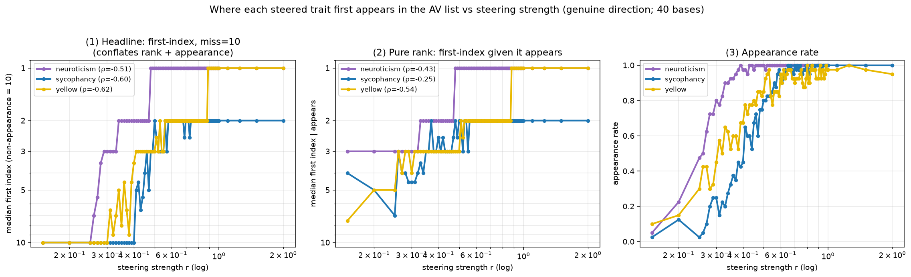
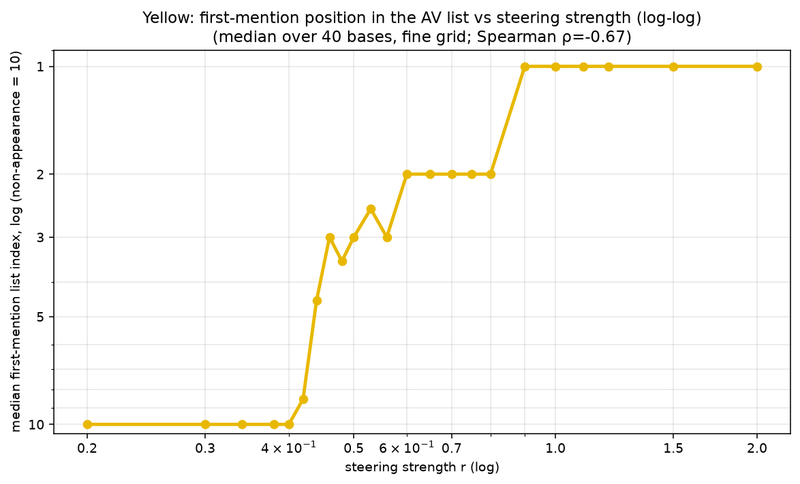

# Steering strength vs where a trait appears in the AV's list (front-loading)

**Question.** The NLA **AV** (activation→text verbalizer) describes an injected activation as a
newline-separated **list of ~10 snippets**. If we inject a *steering direction* for a trait at
increasing strength, **where in that list does the trait first get mentioned**, and how does that
position depend on strength?

**Answer (corrected, decomposed).** As steering strength `r` rises, two things happen, and they are
separable:
1. **Appearance** — the trait enters the list at all, in trait-ordered thresholds
   **neuroticism (~r≈0.3) < sycophancy (~r≈0.4) < yellow (~r≈0.5)**. This is the larger effect
   (Spearman(r, appears) ≈ +0.6 to +0.7).
2. **Rank, given it appears** — conditional on being in the list, the trait climbs toward the top as
   `r` rises: **yellow ρ=−0.54, neuroticism ρ=−0.43, sycophancy ρ=−0.25** (Spearman over appearing
   rows). Real, but smaller than the appearance effect.

The single "non-appearance = 10" curve (panel 1 of the figure) is monotone and clean but **fuses**
these two; the honest reading separates them (panels 2 and 3). This matches the AV's truncation-RL
training, which front-loads salient content: a more dominant injected concept both shows up and is
listed sooner.




## Models

- **Base:** `Qwen/Qwen2.5-7B-Instruct`, `d_model=3584`, extraction **layer 20**.
- **AV:** `syvb/nla-qwen2.5-7b-L20-rltrunc-gradguard` → `kl0.01/iter_0000200/av` (a full Qwen2.5-7B HF
  model + `nla_meta.yaml`; `injection_scale=150`, marker char/ids from the sidecar). RL-trained with
  random-length truncation (this is *why* it orders its list by salience). See `../MODEL_USAGE.md`.

## Method

### 1. Genuine steering direction (`genuine_build.py`)
For each trait, the steering direction is a **raw-text neutral-negative mean difference**:

    v_hat = unit( mean(layer-20 act of on-trait raw sentences) − mean(layer-20 act of neutral raw sentences) )

Activations follow the training convention (raw text + BOS, **last token**, no normalization;
truncate `model.model.layers` to `[:21]`, hook layer 20). The on-trait / neutral sentence sets are
in `genuine_build.py` (`ONTRAIT`, `NEUTRAL`). This construction is **causal and AV-readable**, unlike
A/B answer-letter directions (see the repo README / the `av-caa-readout-confound` note: A/B-extracted
directions are decodable but ~orthogonal to the genuine trait axis, so they neither steer nor
verbalize). The L20 direction is saved in `genuine_dirs.npz` (`{trait}_L20_genuine_unit`).

### 2. Strength sweep + AV verbalization (`frontload_v2.py`, `frontload_yellow.py`)
- **40 neutral base activations** (raw-text L20 last-token; the `NEUTRAL_BASES` list).
- For each base `b` and strength `r`: form `a = b + r·‖b‖·v_hat`, then inject into the AV after
  `normalize_activation(a, 150)`. Because the inject vector is renormalized to a fixed L2=150, **`r`
  only rotates the injected direction toward `v_hat`** (cos(a, v̂) ≈ 0.30→0.71→0.90 as r=0.3→1→2),
  fixed magnitude. `r=0` ⇒ pure neutral base.
- Inject at the marker token via `nla.injection.inject_at_marked_positions` (neighbor-checked;
  asserts one site per prompt), greedily decode 256 tokens with `inputs_embeds`, take
  `extract_explanation_open(...)`, split on newlines → the **list items**.
- **Grids.** All-traits dense run: 82 strengths (`0.15, 0.2`, then `0.25…1.00` in 0.01 steps, then
  `1.1, 1.25, 1.5, 2.0`) × 40 bases × 3 traits = **9,840** explanations. Yellow fine run: 23
  strengths × 40 bases. Lists are capped at 10 items.

### 3. First-mention index (`judge_first_index.py`)
An LLM judge (**Claude Haiku 4.5** via OpenRouter, temperature 0, deterministic, cached) is given the
enumerated list and returns the **1-based index of the first item that references the trait**, or −1.
Rubric (`DEFS` + `PROMPT`, `PROMPT_VERSION="v2"`): strict per-trait definitions with **exclusion
clauses** (yellow excludes other colors; sycophancy excludes scenery-praise / greetings / ordinary
politeness; neuroticism excludes neutral difficulty/effort) and a **"count a snippet only if it
itself references the trait, not if it merely expects/implies it; ignore register/format notes"**
instruction. (The v1 rubric over-counted these at low `r`, inflating the low-`r` appearance ramp.)

### 4. Metric + figures (`plot_frontload_all.py`, `plot_frontload_yellow.py`)
Per `(trait, r)`, over the 40 bases:
- **Panel 1** median first index with **non-appearance imputed = 10** (lists are capped at 10, so the
  imputed value is irrelevant — only "absent vs present" matters; this is what conflates the two
  effects). log-log, y inverted.
- **Panel 2** median first index **over appearing rows only** — the pure conditional rank effect.
- **Panel 3** appearance rate.

## Results (numbers)

| trait | appearance threshold | Spearman(r, appears) | Spearman(r, index \| appears) |
|---|---|---|---|
| neuroticism | ~r 0.3 | +0.60 | **−0.43** |
| sycophancy | ~r 0.4 | +0.70 | **−0.25** |
| yellow | ~r 0.5 | +0.66 | **−0.54** |

- Conditional median first-index falls monotonically with `r` for every trait (e.g. yellow ~7 → 3 → 1
  across the grid); once `r` is large the trait sits at index 1.
- **Caveat — sycophancy degenerates at high `r`:** CJK rate → 1.0 by `r≥1.5` (the AV emits Chinese
  gratitude/agreement spam). The judge still scores it as sycophancy at index 1, but that plateau is
  "trait dominates degenerate output," **not** coherent-list front-loading. Neuroticism and yellow
  stay clean (CJK ≤ 0.07 / 0.15). The action (r ≤ ~1.0) is clean for all three.

### Review caveats (3-subagent audit, all addressed)
- The earlier single-panel figure read a **stale judged file** (wiring bug) and used the **conflated
  metric**; both fixed (correct file + 3-panel decomposition).
- The judge had a low-`r` "present"-skew (scenery/greetings/meta counted); fixed via the stricter v2
  rubric. The skew never manufactured the trend (its errors land at the opposite, low-`r` end).
- No `r=0`/pure-neutral control is run (lowest is `r=0.1`, where appearance ≈ 0 serves as the floor).

## Can we extend the list to detect weaker verbalization? (no — negative result)

Could low-strength non-appearance just be the list ending before the trait's line? Two attempts to
get a longer list, both fail — so the absence is genuine, not truncation:
- **Suppress the close tag + EOS** (`frontload_extend.py`, `mini_extend_check.py`): the AV emits its
  usual ~10 real items then **degenerates into repetition** (`#endif` ×~170). Median items 10→~182,
  but ~95% is junk; no new genuine trait mentions.
- **Ask the prompt for more** (`mini_prompt_check.py`): editing the actor instruction to request "at
  least 25/30 snippets" (keeping `<concept>㈎</concept>` intact) yields **10 → 11 items** — the RL'd
  AV ignores the count request. Lists stay sensible, just not longer.

The AV's list length is effectively fixed at ~10–11 items by truncation-RL training; you cannot buy
more depth by forcing generation or by asking.

## Reproduce

GPU box (≥24 GB) with `transformers`, `nla` on `PYTHONPATH`, base model at
`/workspace/models/qwen2.5-7b-instruct`, AV at `/workspace/av_ckpt`:

```bash
# 1. genuine directions (+ behavioral-steering sanity)
python3 genuine_build.py                       # -> /workspace/genuine_out/genuine_dirs.npz
# 2. dense all-traits AV sweep (9,840 gens)
PYTHONPATH=/workspace python3 frontload_v2.py  # -> /workspace/frontload_out/frontload_v2_raw.json
#    (yellow fine grid: frontload_yellow.py    -> frontload_yellow_raw.json)
# 3. judge first-mention index (local; needs ~/.openrouter_key)
python3 judge_first_index.py results/frontload_v2_raw.json     # -> *_raw_judged.json
# 4. figures
python3 plot_frontload_all.py                  # -> results/fig_frontload_all.png
python3 plot_frontload_yellow.py               # -> results/fig_frontload_yellow_zoom.png
```

## Data

The judged rows that generate the figures (per row: `trait, r, base_idx, n_items, items,
explanation, cjk, first_index`) are on HuggingFace: **[hf.co/datasets/syvb/av-frontload](https://huggingface.co/datasets/syvb/av-frontload)**
(`frontload_all.jsonl` = the 9,840-row all-traits dense run; `frontload_yellow.jsonl` = the yellow
fine grid). Also in `results/frontload_v2_raw_judged.json` / `frontload_yellow_raw_judged.json`.
