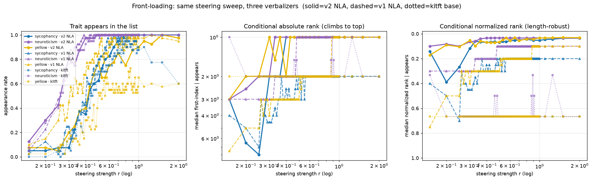

# Front-loading replicates in the v2 RL NLA

A re-run of the [front-loading steering experiment](FRONTLOADING.md) with the **new v2
RL-trained AV** as the readout, instead of the prior `rltrunc-gradguard` model. Question is
unchanged: *as we inject a trait's steering direction at increasing strength `r`, where in the
AV's verbalization list does the trait first appear?*

**TL;DR — yes, the v2 NLA front-loads, and the *appearance* effect is stronger than v1.** Stronger
steering makes the trait (a) enter the list, in the same trait order as before, and (b) sit at the
**top**. The v2 model pins the dominant concept to **index 1 almost as soon as it appears** — even
though its lists are ~3× longer (~29 items vs v1's ~10). The base (untrained) `kitft` verbalizer
shows the appearance effect but **~no salience ordering**, confirming that the truncation-RL training
is what produces front-loading — and the v2 RL run reproduces it.



## Setup (identical to FRONTLOADING.md except the AV)

- **AV (readout):** `syvb/nla-qwen2.5-7b-L20-av-matryoshka-sonnet46-v2-rl`, subfolder
  `iter_0000200` (from_pretrained-ready HF). `injection_scale=150`, marker char/ids from its
  `nla_meta.yaml`.
- **Steering directions:** the *same* genuine L20 neutral-negative mean-difference directions
  (`build_dirs_min.py`, deterministic → bit-identical to v1's `genuine_dirs.npz`) for
  sycophancy / neuroticism / yellow.
- **Injection:** for each of 40 neutral base activations `b` and strength `r`,
  `a = b + r·‖b‖·v̂`, renormalized to L2=150, injected at the marker; greedy-decode 256 tokens,
  split the explanation on newlines → list items. (`frontload_v2.py`, `AV=…/av_ckpt`.)
- **Grid judged:** a dense 22-point `r` subset in `[0.15, 2.0]` × 40 bases × 3 traits = **2,640
  lists**, scored by Claude Haiku 4.5 with the **same v2 rubric** (`judge_first_index.py`). (The
  full 82-point, 9,840-row raw run is kept in `results/frontload_v2model_full_raw.json` for
  re-judging; only the subset was judged to bound cost.)
- **Baselines compared (already on disk):** `frontload_v2_raw_judged.json` (v1 NLA,
  `rltrunc-gradguard` kl0.01/iter_200) and `frontload_kitft_raw_judged.json` (base kitft NLA).

## Results

`sp(app)` = Spearman(r, trait-appears); `sp(idx|app)` and `sp(nrm|app)` = Spearman(r, first-index /
normalized-rank) over rows where the trait appears (negative ⇒ climbs toward the top). `thr@.5` =
first `r` where ≥50% of bases verbalize the trait.

| model | trait | med items | thr@.5 | sp(app) | sp(idx\|app) | sp(nrm\|app) |
|---|---|--:|--:|--:|--:|--:|
| **v2 NLA** | sycophancy | 29 | 0.43 | **+0.62** | −0.26 | −0.35 |
| **v2 NLA** | neuroticism | 29 | 0.30 | **+0.33** | −0.30 | −0.27 |
| **v2 NLA** | yellow | 29 | 0.43 | **+0.53** | −0.27 | −0.52 |
| v1 NLA | sycophancy | 10 | 0.41 | +0.48 | −0.25 | −0.24 |
| v1 NLA | neuroticism | 10 | 0.26 | +0.15 | −0.43 | −0.41 |
| v1 NLA | yellow | 10 | 0.31 | +0.29 | −0.54 | −0.54 |
| kitft (base) | sycophancy | 3 | 0.44 | +0.46 | −0.15 | −0.15 |
| kitft (base) | neuroticism | 3 | 0.26 | +0.20 | −0.05 | −0.05 |
| kitft (base) | yellow | 3 | 0.50 | +0.27 | −0.01 | −0.01 |

### Reading it

1. **Appearance effect replicates and is stronger.** `sp(r, appears)` is positive for all three
   traits and *larger* than v1 (+0.62/+0.33/+0.53 vs +0.48/+0.15/+0.29). Thresholds are close to v1
   and in the same trait order (neuroticism earliest). E.g. yellow appearance climbs 3/40 (r=0.15) →
   31/40 (r=0.5) → 40/40 (r=1.5).
2. **Once it appears, it's at the top — instantly.** The v2 conditional **median first-index = 1
   from r≈0.3 onward** (yellow), with normalized rank ≈ 0.04 *despite ~29-item lists*. So the
   dominant injected concept is placed first even when the list is long.
3. **The conditional "climb" Spearman looks weaker in v2 (−0.26…−0.30) than v1 (−0.43…−0.54) — but
   that's a ceiling, not a weaker effect.** v2 reaches index 1 so fast that there is no room left to
   climb; the front-loading "action" has moved almost entirely onto the appearance axis.
4. **Base verbalizer = appearance, no ordering.** kitft shows the appearance effect (it's a property
   of the injected vector) but `sp(idx|app) ≈ 0/−0.05/−0.15` — it does **not** order its (3-item)
   list by salience. This isolates salience-ordering as a *trained* behavior, reproduced by the v2
   RL run.

## Qualitative (yellow, base 0, increasing r) — see `results/v2model_qualitative.txt`

```
r=0.15  silk/textile history (pure neutral base — no yellow)
r=0.40  "this beautiful fabric ... my own beginnings" (lace; yellow not yet present)
r=0.60  "I have always loved this flower ... tulips ... Easter"  (yellow-adjacent)
r=1.00  1. "yellow is my favorite color ..."  2. "...passion for Marigold..."  (explicit, index 1)
```

The v2 AV's style is notably more **meta-descriptive** than v1 ("American blogger introducing passion
for…", "expects continuation") rather than emitting trait text verbatim, yet the trait content
surfaces cleanly and the judge detects it. CJK is ~1% (clean).

## Reproduce

```bash
# GPU box (≥24 GB), repo on PYTHONPATH, base model + v2 AV downloaded (driver_frontload.sh):
python3 build_dirs_min.py                                   # genuine_dirs.npz (deterministic)
AV=/workspace/av_ckpt OUT_NAME=frontload_v2model_raw.json \
  python3 frontload_v2.py                                   # 9,840 gens -> raw json
# local (needs ~/.openrouter_key):
python3 judge_first_index.py results/frontload_v2model_raw.json
python3 plot_model_compare.py                               # fig + summary table
```
