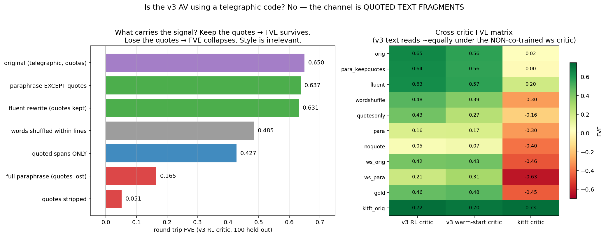

# Is the v3 AV using a telegraphic code? — No. The channel is quoted text fragments.

Follow-up to the paraphrase-brittleness finding (v3 RL round-trip FVE 0.650 → 0.165
under line-wise paraphrase, vs 73% retention for the pre-RL warm-start pair). Three
hypotheses: (a) verbatim-quote channel, (b) telegraphic-style / pair-specific code,
(c) genuine semantics. Verdict: **(a), decisively — and the "quotes" are mostly
*predicted* local text, not copies.** No evidence of a private code.

## Evidence

**1. Quote-preserving paraphrase retains ~98% of FVE** (the decisive test).
Paraphrasing *everything except* the `"..."` spans: 0.650 → **0.637**. Full
paraphrase (quotes destroyed): → 0.165. Quotes stripped: → **0.051**. Quoted spans
*alone*: **0.427** (2/3 of the signal in ~22% of the characters). The entire
paraphrase brittleness is quote destruction.

**2. Style is irrelevant — not a telegraphic code.** Rewriting every line as a
fluent grammatical sentence (quotes kept byte-identical): 0.650 → **0.631**.
Word-shuffle within lines: 0.485 (bag-of-words carries most of the rest).

**3. Not pair co-adaptation.** The pre-RL warm-start critic — never co-trained
with the RL actor — reads v3 RL text at **0.563** vs the co-trained critic's 0.650,
and shows the *same* paraphrase collapse (0.171). A v3rl-critic-specific code would
show a large orig gap and critic-specific paraphrase behavior; neither appears.
(The kitft critic reads nothing in this format — it scores even gold Sonnet text at
−0.45 — it is format-locked, not evidence about v3.)

**4. The text is fully legible to outside readers.** 4-way source-context
retrieval by Claude Haiku: **100%** for v3 original, paraphrased, quote-stripped,
fluent, warm-start, and gold variants (n=100 each). Not opaque steganography —
though the 4-way task is easy; this bounds legibility from below.

**5. What the quotes actually are.** RL tripled quote density (11.3 spans/expl,
22% of chars, vs warm-start 4.3/5.7% and gold Sonnet 3.6/5.5%). Only **26% are
verbatim** from the source context (those concentrate in the last 200 chars — the
region the last-token activation most encodes); the rest are the AV's *predictions*
of nearby text rendered in quote form (e.g. `"and even writes some of"`). The AV
communicates the activation by exhibiting the local text it implies — arguably the
most direct possible verbalization of a next-token-predictive residual state, but it
means FVE is earned by exact token sequences, not by the abstract commentary around
them (which contributes almost nothing: quotes-stripped = 0.05).

**6. Token saliency agrees.** Leave-one-token-out under the v3rl critic: highest-
impact tokens are the quote marks themselves and the content words inside them
(`"`, `Rated`, `-foot`, `registered`), not function words or format tokens.

## Implications

- The v3 (and likely v1/v2) truncation-RL FVE gains are real information transfer,
  but the *mechanism* is "front-load predicted text fragments", not "front-load
  abstract descriptions". Interpretability users should read the quotes as the
  payload and the prose as low-bit framing.
- Cross-model: every critic reads kitft's verbose quote-heavy text best of all
  (0.70-0.73) — quoting has always been the NLA channel; RL simply concentrated it.
- If abstract-semantic explanations are the goal, a future reward could penalize
  quote reliance (e.g. reconstruct from a quote-stripped copy) — at a likely
  steep FVE cost, which would itself quantify how much of the activation is
  "about" exact local text.

## Files
- `code_invest_matrix.json` — 11 variants × 3 critics FVE + saliency (GPU stage)
- `code_invest_transforms.json` — all text variants incl. LLM rewrites
- `code_invest_stats.json` — quote/copy-rate/style statistics
- `code_invest_judge.json` — retrieval accuracies
- generated by `code_invest_matrix.py` (repo) + local prep/API scripts

Cost: ~$3 total (two short 4090 rentals + ~1k Haiku calls).

## Addendum: marginal FVE per token, in-quote vs out (`eval_quote_marginal.py`)

Sequential per-token attribution (ΔFVE of adding each token to the prefix,
fig_quote_marginal.png):

| pair | quote tokens | share of FVE | in-quote ΔFVE/tok | out-of-quote |
|---|---|---|---|---|
| v3 warm-start | 14.1% of tokens | **62.5%** | 0.0141 | 0.0014 (**10×** less) |
| v3 RL | 36.7% of tokens | 35.5% | 0.0037 | 0.0039 (**1.0×** — equal) |

In the warm-start, quotes are THE high-density channel (10× per-token value).
After RL, per-token value is **uniform across quote membership** — RL didn't
just add quotes, it densified the non-quote text to quote-level information
density (much of it is unquoted predicted-text fragments anyway).

Reconciling with the ablations (marginal credit ≠ necessity): quotes are
*standalone-sufficient* (0.427 alone) and exact-form-critical (paraphrase
kills them); the non-quote prose adds real, paraphrase-ROBUST FVE **given**
the quotes (+0.21: para_keepquotes 0.637 vs quotesonly 0.427) but is nearly
worthless alone (noquote 0.051). Sequential attribution splits credit by
position over content the two classes largely share; ablation reveals the
asymmetric dependence: quotes anchor, prose elaborates.
