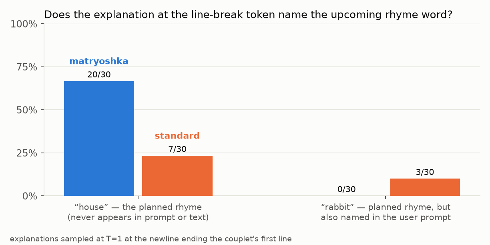
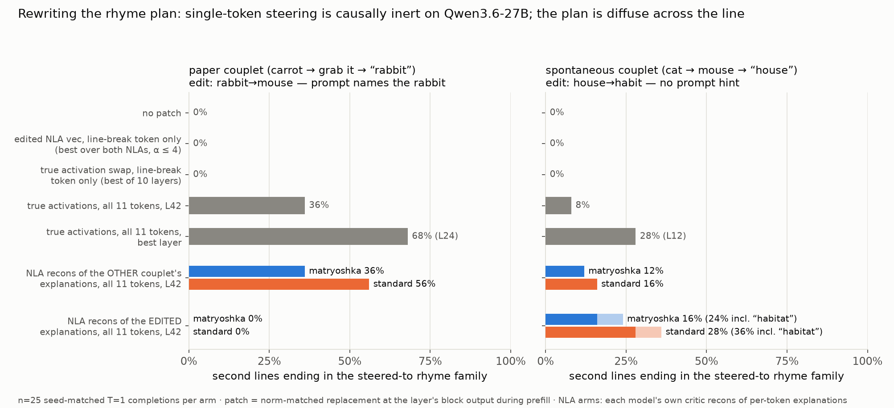

# Planning in Poetry, reproduced on Qwen3.6-27B — matryoshka vs standard NLA

Reproduction of the NLA paper's "Planning in Poetry" case study (rhyming-couplet
planning + causal steering via explanation edits, Opus 4.6/Haiku 3.5 there) on
Qwen3.6-27B with both 27B NLAs (`ceselder/nla-qwen36-27b-matryoshka`,
`ceselder/qwen3.6-27b-nla-L42`, both at L42). Chat-template framing (user turn +
pre-closed think + prefilled first line); the model writes the second line.
Scripts: `poetry_steer.py` (phased: baseline / av / encode / steer / controls /
layers / mencode / msteer), `screen_couplets.py`, `tally_steer.py`,
`walkthrough.py`, `plot_poetry.py`. Artifacts in `results/poetry/`.

**TL;DR.** The observational claim reproduces — at the line-break token the
NLA explanation names the not-yet-written rhyme word, and the **matryoshka NLA
does so 3× more often than the standard (67% vs 23%)**. The paper's causal
protocol (edit the explanation at the newline, steer that one token) fails —
but for a model-level reason our controls pin down: **on Qwen3.6-27B the rhyme
plan is causally inert at any single token/layer and is instead diffuse across
the whole line**. Patching all 11 first-line tokens with critic reconstructions
of *edited* explanations does causally rewrite the rhyme (habit-family endings
0% → 16–36%), with the **standard NLA beating the matryoshka causally (36% vs
24%)** even though the matryoshka wins observationally.

## 1. Adapting the couplet (screening, N=25 per candidate)

The paper's exact prompt doesn't transfer: with "Write a rhyming couplet." +
"He saw a carrot and had to grab it," the base model ends the second line with
"rabbit" only **4/25** — it prefers two-word "-ab it" rhymes ("nab it").
Screened 7 framings (`po_screen.json`); kept two complementary winners:

| tag | user prompt | first line | plan word (baseline) |
|---|---|---|---|
| **paper** | "Write a rhyming couplet about a rabbit." | He saw a carrot and had to grab it, | rabbit **20/25** — but the prompt names it |
| **spont** | "Write a rhyming couplet." | The old grey cat had spied a mouse, | house **12/25** — fully spontaneous plan |

Edits follow the paper (rabbit→mouse, habit→house, carrot→cheese), reversed for
spont (mouse→rabbit, house→habit, cheese→carrot). Caveat that applies
throughout: these positions sit at ~token 30, *below* the NLAs' training
minimum of 50 context tokens; reconstructions are weak here (FVE ≈ 0.33–0.46
at the steer token vs ≈ 0.65–0.69 on precache texts).

## 2. Observational: the explanations do surface the plan

At the newline ending line 1 (n=30 explanations each, T=1): on **spont**, the
matryoshka names **"house" — a word appearing nowhere in prompt or text, only
in the model's future — in 20/30 explanations (67%)** vs the standard's 7/30
(23%). Per-token traces (`walkthrough.py`): "house" first appears once " mouse"
is on-screen (the rhyme constraint), peaking at the line break — the paper's
token-19/21 pattern. On **paper**, "rabbit" saturates explanations at tokens
0–9 (context-reading — the prompt names it) then *collapses at the newline*
(mat 0/30, std 3/30): the newline activation reads as structural
("second line of a rhyming animal couplet needed") and the matryoshka
confabulates specifics ("He saw a giant burrito", "He ate all the shrimp") —
the paper's confabulation caveat, amplified by the terse line format at an
OOD-early position.

## 3. Causal: the paper's single-token steer can't work here — the plan is diffuse

Per arm: n=25 seed-matched T=1 completions; metric = second lines ending in the
steered-to rhyme family (mechanical last-word extraction, `po_tally.json`).

1. **Paper protocol (single-token, newline, L42): 0% everywhere.** Direct
   patch of v̂(edited), Δ-steer at α∈[0.25,4] — original rhyme survives at
   ~baseline rates for both NLAs, both couplets. Matches the paper's own Opus
   appendix result (patching "does not lead to modified behavior").
2. **Not the NLAs' fault — true activations also do nothing at one token.**
   Patching the *other couplet's* real activation at the newline: no effect at
   L42, and none at any of 10 layers (L6→L60). The single-token channel does
   not exist on this model.
3. **The plan is diffuse across the line.** Patching all 11 first-line
   positions with the other couplet's true activations flips the rhyme:
   paper→"house" endings 64%/68%/52%/36%/0% at L12/L24/L36/L42/L54. (The
   reverse direction reads lower on the strict word list — 28% at L12 — but
   15–16/25 completions switch to the paper couplet's "-it" rhyme family at
   L36–L42.) Causal window: early-mid layers, fading right at L42 and gone by
   L54, where the plan has already been read out.
4. **Whole-line NLA reconstructions carry the plan causally.** Patching the 11
   positions with each critic's reconstructions of the *other* couplet's
   per-token explanations transfers the rhyme: paper→house **56% (std)** / 36%
   (mat) — the std matching or beating the true-activation transplant at L42
   (36%).
5. **The paper's edit works at multi-token granularity — where the
   explanations verbalize the plan.** On spont (house→habit edit):
   habit-family endings **0% → 28% strict / 36% incl. "habitat" (std)** and
   **16% / 24% (mat)**, while the unedited-reconstruction control preserves
   "house" (52–56%) and every other arm sits at 0%. On paper, the mouse-edit
   still fails for both — the explanations at these positions barely mention
   "rabbit" (mat 0/30), so the substitution has nothing to rewrite; the
   unedited whole-line reconstruction patch already collapses the rabbit rhyme
   (80% → 12–16%), confirming the reconstructions never encoded that plan.

## 4. Matryoshka vs standard

- **Observational (reading the plan): matryoshka wins 3×** (67% vs 23% plan
  mention at the line break on the spontaneous couplet).
- **Causal (steering with edited explanations): standard wins** (36% vs 24%
  loose; 28% vs 16% strict; cross-couplet transfer 56% vs 36%). The standard's
  verbose per-token explanations re-encode into richer line reconstructions;
  the matryoshka's terse lines drop payload nouns (and confabulate substitutes)
  at these short-context positions, leaving less to edit.
- Both NLAs fail identically under the paper's literal single-token protocol,
  and the layer sweep shows *nothing* could succeed there on this model — the
  informative reproduction required generalizing the protocol to the token
  span, which the paper itself anticipates ("diffuse across tokens" is one of
  their hypothesized failure causes, and their Haiku patching only worked at
  the localized planning layer).

Caveats: n=25/arm (binomial SE ≈ 10pp at the observed rates); one couplet per
regime; positions below the NLA training range; last-word rhyme extraction is
mechanical (no judge); the "paper" couplet's plan is prompt-anchored, so its
walkthrough evidence is context-reading rather than pure planning — the spont
couplet carries the planning claim.

## Provenance

RunPod secure-cloud A100 80GB PCIe (`n85oc1zut8mjb3`), same env as
STEERING_TRUNCATION.md (torch 2.7.1+cu126, transformers 5.5.4, peft 0.19.1,
fla + causal-conv1d built `--no-build-isolation`). ~2.5 h GPU for this
experiment (screen 10 min; main chain 65 min; supplemental AV/encode 25 min;
controls + layer sweep 25 min; multi-token pass 20 min). Rhyme scoring is
mechanical; no LLM judge used.
