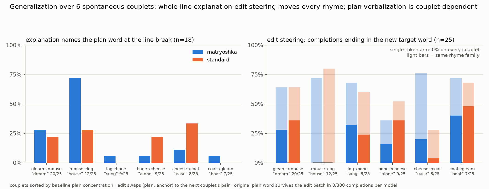

# Does the NLA see the rhyme coming? "Planning in Poetry" on Qwen3.6-27B

*A self-contained reproduction of the "Planning in Poetry" case study from
"Natural Language Autoencoders Produce Unsupervised Explanations of LLM
Activations" (Transformer Circuits, 2026), run on Qwen3.6-27B with two
independently trained NLAs. Two GPU runs, 2026-07-18/20.*

## Background: the models and the original case study

A **natural-language autoencoder (NLA)** is a pair of models trained jointly:
an **activation verbalizer (AV)** that takes one residual-stream activation
from a target LLM and generates a natural-language explanation of it, and a
**critic / activation reconstructor (AR)** that reads only that text and
predicts the activation back. If the explanation is faithful, the
reconstruction lands close to the true activation (measured as FVE, fraction
of variance explained), and — the causal hope — putting the reconstruction
*back into the model* should reproduce the behavioral effect of the original
activation.

We test two NLAs trained on **Qwen3.6-27B** (64 layers, d_model 5120), both
reading **layer 42** block-output activations:

- **matryoshka** (`ceselder/nla-qwen36-27b-matryoshka`): explains in
  salience-ordered independent lines, most important first (~10–20 words per
  line);
- **standard** (`ceselder/qwen3.6-27b-nla-L42`): explains in `<explanation>`
  prose (~4–5 sentences, ~100+ words).

The paper's case study revisits Lindsey et al.'s poetry-planning result.
Given the prompt

```
A rhyming couplet:
He saw a carrot and had to grab it,
```

the model will end the second line with "rabbit" — and the claim is that it
*decides this early*: at the newline ending the first line, the NLA
explanation of the activation already talks about a rabbit before any rabbit
has been written. The paper then validates this causally: **edit** the
explanation (rabbit→mouse, habit→house, carrot→cheese), re-encode both
versions with the AR, and steer the model at that newline token with the
difference Δ = AR(edited) − AR(original), rescaled to α·‖h‖. On Opus 4.6
this flips the rhyme to "mouse"/"house" roughly half the time. Two paper
caveats matter for what follows: their *direct patching* (replacing the
activation outright with the edited reconstruction) did **not** change Opus's
behavior, and on Haiku 3.5 patching only worked when the NLA was trained at
the specific layer where the planning mechanism had been localized.

## Setup

Everything runs on the raw Qwen3.6-27B base with the Qwen 3.6 chat template:
a user turn requesting a couplet, a pre-closed think block, and the couplet's
first line prefilled as the assistant's answer; the model then samples the
second line (T=1, top_p=1.0, top_k=0, 25 samples per condition, seed-matched
across conditions). The steered token is the newline ending line 1 — the
paper's choice. Interventions are forward hooks on a layer's block output
during prefill only:

- **patch**: `h[pos] ← ‖h[pos]‖ · v/‖v‖`
- **steer**: `h[pos] ← h[pos] + α·‖h[pos]‖ · Δ/‖Δ‖`
- **whole-line patch**: patch every token of the first line (incl. the
  newline) simultaneously, each position norm-matched to its own live norm.

Explanations are generated by each AV from the true L42 activation at each
line token (the injection path and prompt template are the same ones
validated in this repo's Space demos); edits are word-level substitutions;
reconstructions come from each NLA's own critic. Outcomes are scored
mechanically: the last word of the generated second line, tallied over 25
samples. No LLM judge. Scripts: `poetry_steer.py` (main pipeline + controls),
`poetry_gen.py` (generalization), `screen_couplets.py`, `tally_steer.py`,
`walkthrough.py`, `pg_analyze.py`, plots in `plot_poetry.py`. All raw
generations and vectors are in `results/poetry/`.

## Finding 0: the paper's exact prompt doesn't transfer — and concentrated plans are rare

With the paper's bare framing, Qwen3.6-27B ends the couplet with "rabbit"
only **4/25** times; it prefers two-word "-ab it" rhymes ("had to nab it").
Screening 19 candidate framings across the two runs produced the working set:

- **paper couplet**: "Write a rhyming couplet about a rabbit." + the paper's
  first line → "rabbit" 20/25 (plan is prompt-anchored);
- **six spontaneous couplets** (prompt just "Write a rhyming couplet.", no
  content hint): cat/mouse→**house** 12/25, stars/gleam→**dream** 20/25,
  frog/log→**song** 9/25, dog/bone→**alone** 9/25, mouse/cheese→**ease**
  8/25, hat/coat→**boat** 7/25.

Notably, only 2 of 12 screened spontaneous first lines yield a ≥40%
concentration on a single rhyme word — on this model, a sharply concentrated
one-word plan (the premise of the case study) is the exception, not the rule.

## Finding 1 (observational): explanations sometimes name the unwritten rhyme — but unreliably, and the matryoshka's advantage is one couplet's

At the line-break token we sample explanations (n=18–30) and count how often
they name the *plan word* — a word that exists nowhere in the prompt or text,
only in the model's future:

| couplet | plan (baseline rate) | matryoshka mentions | standard mentions |
|---|---|---|---|
| cat/mouse | house (48%) | **67–72%** (two runs) | 23–28% |
| stars/gleam | dream (80%) | 28% | 22% |
| dog/bone | alone (36%) | 6% | 22% |
| mouse/cheese | ease (32%) | 11% | 33% |
| frog/log | song (36%) | 6% | 0% |
| hat/coat | boat (28%) | 6% | 0% |


The headline case reproduces beautifully: on the cat/mouse couplet the
matryoshka names "house" in ~70% of explanations, 3× the standard's rate, and
this replicated across two independent runs. But it does not generalize: on
the other five couplets the two NLAs are statistically indistinguishable
(pooled ~10% vs ~16%), and both badly under-report even very strong plans
(the gleam couplet ends "dream" 80% of the time; neither NLA mentions "dream"
in more than 28% of explanations). On the prompt-anchored paper couplet,
"rabbit" saturates explanations over the visible text (context-reading, since
the prompt names it) and then *collapses at the newline* (matryoshka 0/30,
standard 3/30), where the matryoshka instead confabulates specifics — "He saw
a giant burrito", "He ate all the shrimp". One structural caveat: these
positions sit ~30 tokens into the context, below the NLAs' training minimum
of 50 tokens, and reconstruction quality is correspondingly weak (FVE ≈
0.33–0.46 at the steer token, vs ≈ 0.65–0.69 on in-distribution text).

## Finding 2 (causal): nothing works at one token — the plan is diffuse across the line

The paper's protocol steers a single token. On Qwen3.6-27B this fails
completely, and a ladder of controls shows why (n=25 per arm):


1. **Edited-explanation steering at the newline: 0%** — direct patch of the
   edited reconstruction and Δ-steering at α ∈ {0.25…4}, both NLAs, all
   couplets: the original rhyme survives at baseline rates.
2. **Not the NLAs' fault: true activations also do nothing.** Swapping in the
   *real* activation from a different couplet's newline changes nothing — at
   L42 or at any of ten layers L6→L60. There is no single-token causal
   channel for the rhyme in this model. (This echoes the paper's own
   findings: patching failed on Opus, and worked on Haiku only at the
   localized planning layer.)
3. **The plan is spread across the whole line.** Patching all 11 first-line
   positions with the other couplet's true activations flips the rhyme:
   64%/68%/52%/36%/0% at layers 12/24/36/42/54. The causal window is
   early-to-mid stack, already fading at L42 (where the NLAs live) and gone
   by L54, where the plan has been read out.

## Finding 3 (causal): whole-line steering with edited explanations rewrites the plan — on every couplet

Generalizing the paper's protocol to the token span: explain every first-line
token, apply the word substitutions to each explanation, re-encode each with
the critic, and patch all positions at L42 with the edited reconstructions.
Each spontaneous couplet was edited toward another couplet's (plan, anchor)
pair (e.g. the cat/mouse couplet's house→song, mouse→log).



| couplet (edit→) | mat strict / family | std strict / family |
|---|---|---|
| gleam→mouse | 28% / 64% | 36% / 64% |
| mouse→log | 0% / 72% | 0% / 80% |
| log→bone | 32% / 68% | 24% / 60% |
| bone→cheese | 16% / 36% | 36% / 52% |
| cheese→coat | 20% / 76% | 4% / 28% |
| coat→gleam | 40% / 72% | 48% / 68% |

("strict" = second line ends with the exact new target word; "family" = any
word in the new rhyme family, final-2-char heuristic — e.g. fog/bog/jog for a
"log" target.)

- The **original plan word survives in 0/300 completions per model** — the
  edit patch eliminates the old rhyme on every couplet, while the
  unedited-reconstruction control preserves it and the single-token version
  of the same edit does nothing (0% on all six).
- The "strict-miss" rows are family-hits: after the mouse→log edit the model
  ends lines with fog/bog/frog/jog — it accepted the transplanted anchor and
  chose its own rhymes for it.
- Cross-couplet transfer works too: patching one couplet's line with the
  *unedited* reconstructions of another couplet's explanations imports that
  couplet's rhyme (up to 56% — more effective than transplanting the true
  activations at the same layer, 36%, suggesting the reconstructions denoise
  toward the content).
- **The two NLAs are at causal parity**: mean strict 23% (mat) vs 25% (std),
  family 65% vs 59%. A one-couplet first run had suggested the standard was
  causally stronger; across six couplets that gap is noise.

## What this says about the paper's claims

- **The observational claim survives, weakened**: NLA explanations can
  surface a genuinely unwritten plan word at the position the paper predicts,
  but on this model+NLA pair it is couplet-dependent and never dominant, and
  neither the matryoshka's line format nor the standard's prose is reliably
  better at it.
- **The causal claim survives, relocated**: explanation edits do causally
  control the planned rhyme — through the critic, at the NLA's own layer —
  but only when applied across the token span, because on Qwen3.6-27B the
  plan is not causally concentrated in the newline token at any layer. The
  paper anticipated exactly this failure mode ("diffuse across tokens") for
  its own Opus steering; here we confirm it with true-activation controls and
  show the multi-token fix works.
- Everything above is n=25/arm (binomial SE ≈ 10pp), mechanical last-word
  scoring, positions below the NLAs' training context range, and one target
  model — the layer/token localization story is specifically Qwen3.6-27B's.

## Reproduction

RunPod secure-cloud A100 80GB PCIe ($1.39/hr), torch 2.7.1+cu126,
transformers 5.5.4, peft 0.19.1, flash-linear-attention + causal-conv1d
(built `--no-build-isolation` — without it the qwen3_5 forward silently runs
on CPU). Run 1 (`n85oc1zut8mjb3`, ~2.5 h GPU): screening, main pipeline,
single-token arms, layer sweep, multi-token pass. Run 2 (`rod5cxgzf064r7`,
~1.8 h): 12-couplet screen + 6-couplet generalization. Total ≈ $8. Raw
artifacts (all generations, explanations, reconstruction vectors, tallies):
`results/poetry/po_*` (run 1), `results/poetry/pg_*` (run 2).
