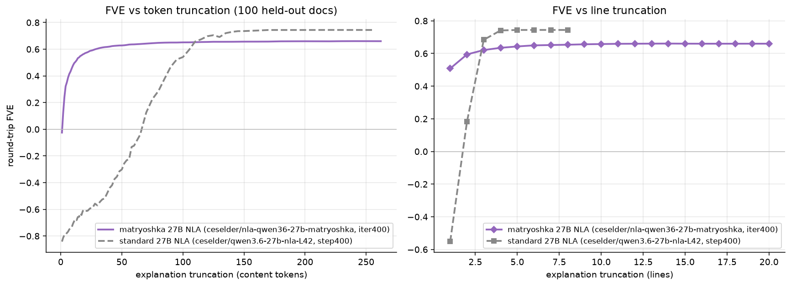
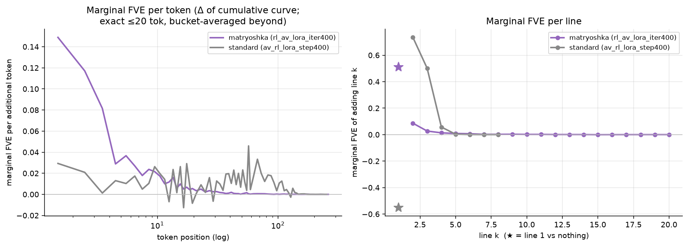
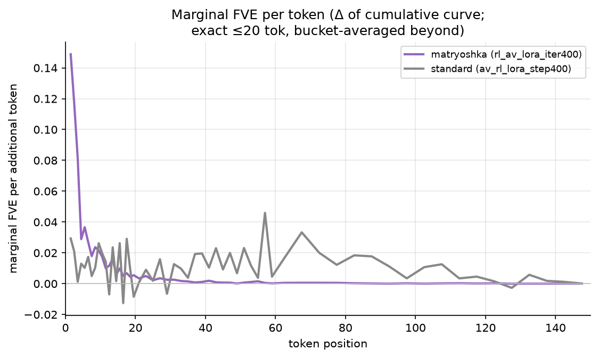
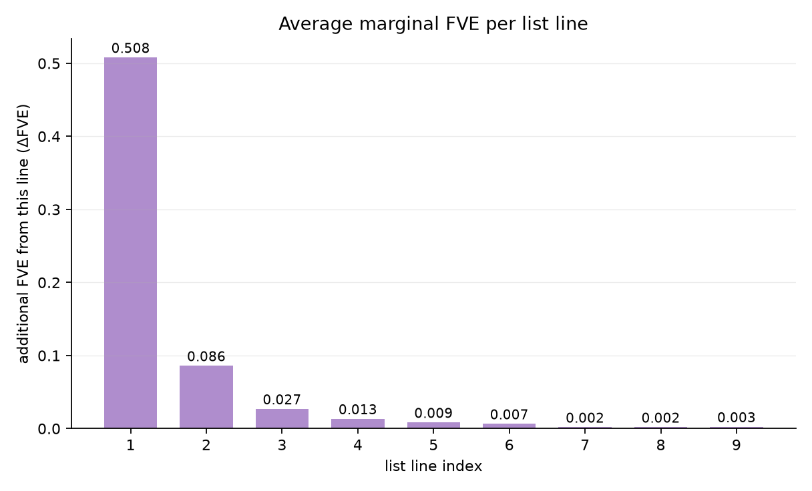
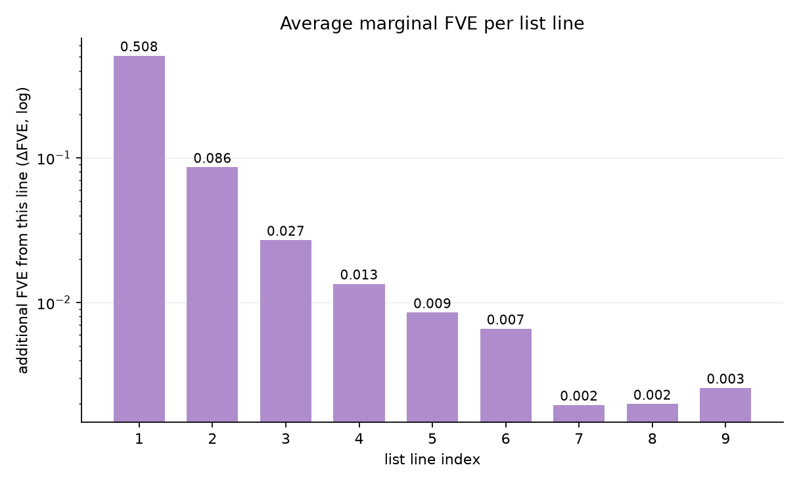
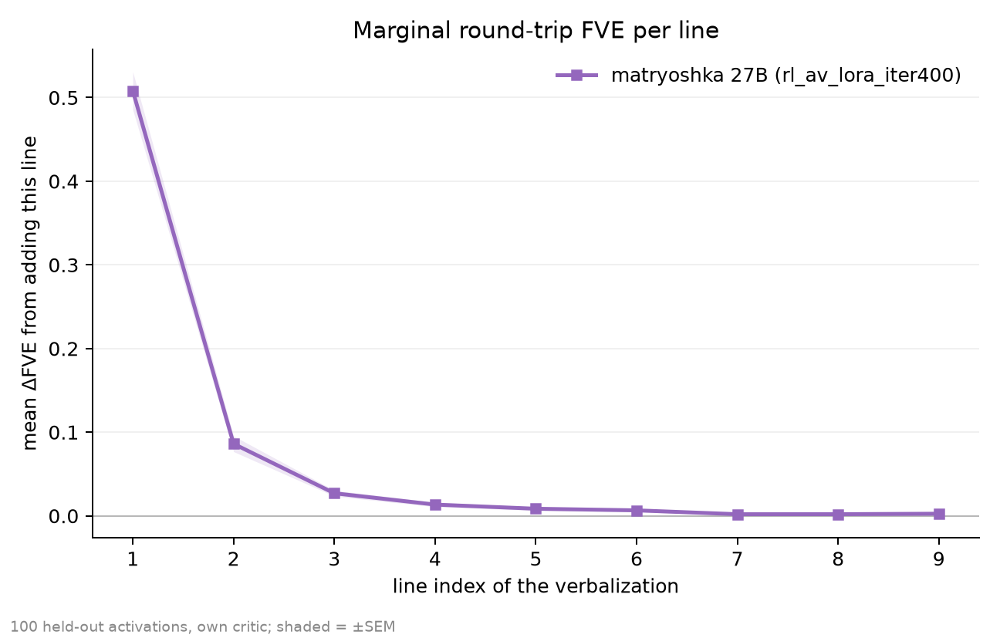
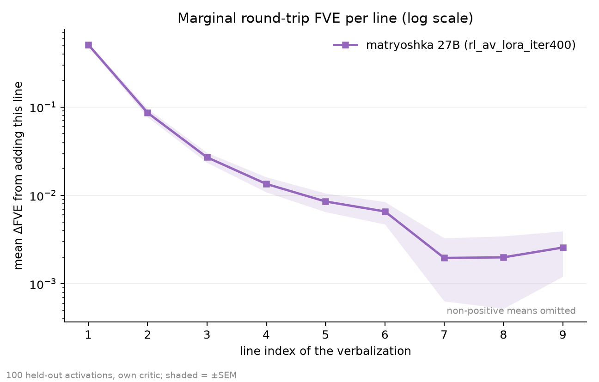

# Qwen3.6-27B NLA eval results (corrected protocols)

Models under test, each sampled with its **verified-correct inference protocol**
(T=1, `top_p=1.0`, top-k off, `enable_thinking=False` chat template, everywhere):

- **matryoshka NLA** — `ceselder/nla-qwen36-27b-matryoshka`, `rl_av_lora_iter400`
  on the raw text base. Protocol: **no prefill, no tags**; the model rarely emits
  EOS (its truncation reward never reached past ~120 content tokens) — cut at the
  token budget. *This is the model of interest.*
- **standard NLA** (reference) — `ceselder/qwen3.6-27b-nla-L42`, base +
  `av_sft_lora` merged + `av_rl_lora_step400`. Protocol: **prefill
  `<explanation>\n`, cut at `</explanation>`** (its RL harness used a stop
  string; it cannot generate the opening tag itself, and text after the close is
  untrained). Discovered 2026-07-09 after junk `<`-openers exposed the mismatch.

Injection: EasyNLA karvonen add-norm hook at the layer-1 output (direction-only),
markers/templates from the dataset sidecar. Held-out eval:
`ceselder/nla-qwen36-27b-matryoshka-data/av_eval.parquet`. FVE/MSE are **own-critic**
(each AV scored by its co-trained reconstructor) — cross-model levels carry that caveat.

Earlier dash-prefill-era artifacts were superseded and removed: the `- ` prefill
was measured harmless for both RL policies' full-length reconstruction but
depressed the matryoshka model's short-prefix FVE (0.17 → 0.48 at 10 tokens
after correction) by displacing its trained completion-first opener.

## FVE vs explanation truncation

100 held-out distinct-doc samples. The matryoshka model is FVE-positive by
token 2, hits **0.48 at 10 tokens** and 0.57 at 20 (above its model card's
0.43/0.52), first line alone 0.51, plateau 0.657 — its 10-token prefix carries
~73% of full-explanation FVE. The standard reference is *negative* (worse than
the mean predictor) until ~70 tokens, then plateaus higher (0.74): the classic
matryoshka trade — frontloading bought with some full-length ceiling. Curves:
`results/{token,lines}_fve_{mat,std}.csv`.

## Two-concept ratio test (causal ordering)

Inject `a = b + ||b||(r_y·v̂_yellow + r_s·v̂_syco)` into 40 neutral base
activations; sweep λ = log₂(r_y/r_s) over [−3, 3] at three total strengths;
judge every line 3-way for both traits (Claude Haiku, rubric identical to the
v3 study); read out P(yellow mentioned first). The matryoshka model's
first-mention order tracks the injected component ratio as a steep logistic
(slopes +1.69/+2.40/+2.52, floor ≈0, ceiling ≈0.95, n≈720/panel, 0 judge
failures): it *ranks* concepts by their share of the injection across a
64-fold ratio range.

**Departure from the 7B result:** unlike v3-vs-kitft (where the baseline was
flat), the standard 27B model ALSO orders by ratio (slopes +1.63/+1.53/+1.45)
— the matryoshka model is steeper at moderate/high strength and saturates
cleanly where the standard flattens mid-curve, but the separation is much
smaller than at 7B. Plausible reading: a stronger base model spontaneously
verbalizes the dominant component of a mixture first; ordering training
sharpens rather than creates the capability. Granularity caveat: the standard
model emits ~5 long lines vs the matryoshka's ~12 short ones, so its
line-level order readout is coarser (v3 handled this with a word-chunk
control, not yet rerun here).

## Marginal FVE per token / per line

Linear-x version of the per-token panel:

Differences of the cumulative truncation curves. The matryoshka model's first
~5 tokens each buy 0.08–0.15 FVE, nearly spent by ~40 tokens; the standard
model's information arrives late and diffusely (small marginals persisting
past 100 tokens; its line 1 is *negative*, corrected by lines 2–3).

v3-style per-line bar charts, matryoshka only (line 1 carries 0.508 ΔFVE ≈
77% of recoverable variance, vs 0.334/≈50% for the 7B v3 model):

Per-example version with ±SEM over 100 held-out activations (line 1 =
0.508 ± 0.023 ΔFVE):

## KL vs reconstruction contribution during RL

Measured offline from the released checkpoints (no wandb): per-token
`truncated_dist_kl(iter400 ‖ warmstart)` over 24 training-faithful rollouts,
compared to the GRPO policy-gradient term's scale (|A|≈0.80/token — advantages
are group-normalized). The policy moved most at the *start* of the response
(~6 nats/token in the first 5 positions vs ~1.1 late) — where matryoshka
training pays. Under every plausible coefficient (tapered 0.02·0.5^(t/40),
flat β=0.01, flat β=0.2) the KL term stays below the PG term at essentially
every position: reconstruction dominated the run's gradient (KL share of loss
magnitude ≈1.2% / 1.7% / 26% respectively). Caveat: converged-policy
measurement; the true β/taper lives in the training fork.

## Frontloading under single-trait steering

Rerun under corrected protocols in progress; the dash-era figure was removed.
Judged-so-far summary (first-mention list index vs steering strength r,
Spearman): standard model ≈ 0 (+0.25 yellow / +0.39 neuroticism / +0.03
sycophancy — no frontloading); matryoshka dash-era showed −0.49…−0.57 and its
corrected rerun completes shortly.

## Sample sets (same 12 held-out rows throughout)

- `matryoshka_samples.md` / `matryoshka_samples_fve.md` — the model of
  interest, with per-sample FVE, source-text tails, and standard-model
  reference outputs.
- `step400_corrected_samples.md` — the reference model under its tag protocol.

Notable quirks (both real model behavior, not harness): the matryoshka model
leaks CJK on ~12% of gold-activation generations and ~30% under steered (OOD)
activations; the standard model's unprefilled first token collapses to `<`
(orphaned SFT-era tag residue).
