# Qwen3.6-27B NLA eval results (corrected protocols)

Models under test, each sampled with its **verified-correct inference protocol**
(T=1, `top_p=1.0`, top-k off, `enable_thinking=False` chat template, everywhere):

- **matryoshka NLA** — `ceselder/nla-qwen36-27b-matryoshka`, `rl_av_lora_iter400`
  on the raw text base. Protocol: **no prefill, no tags**; the model rarely emits
  EOS (its truncation reward never reached past ~120 content tokens) — cut at the
  token budget. *This is the model of interest.*
- **standard NLA** (reference) — `ceselder/qwen3.6-27b-nla-L42`, base +
  `av_sft_lora` merged + `av_rl_lora_step400`. Protocol: **prefill
  `<explanation>\n`, cut at `</explanation>`** (its RL harness used a stop
  string; it cannot generate the opening tag itself, and text after the close is
  untrained). Discovered 2026-07-09 after junk `<`-openers exposed the mismatch.

Injection: EasyNLA karvonen add-norm hook at the layer-1 output (direction-only),
markers/templates from the dataset sidecar. Held-out eval:
`ceselder/nla-qwen36-27b-matryoshka-data/av_eval.parquet`. FVE/MSE are **own-critic**
(each AV scored by its co-trained reconstructor) — cross-model levels carry that caveat.

Earlier dash-prefill-era artifacts were superseded and removed: the `- ` prefill
was measured harmless for both RL policies' full-length reconstruction but
depressed the matryoshka model's short-prefix FVE (0.17 → 0.48 at 10 tokens
after correction) by displacing its trained completion-first opener.

## FVE vs explanation truncation (clean held-out)

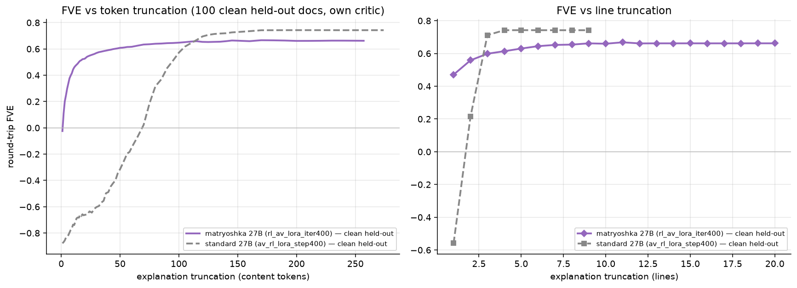

100 clean held-out docs (Ultra-FineWeb idx 300000+, fresh L42 extraction —
provably outside the 0–100k training range). Matryoshka: FVE-positive by
token 2, 0.443 within the first 10 tokens, 0.526 within 20, plateau 0.662;
first line alone 0.471. The standard model (clean, tag protocol): negative
until ~70 tokens, plateau 0.743 — the kitft-shaped baseline, now fully clean.
Contamination effect was small (mat 0.657→0.662). Curves:
`results/clean{,_std}_{token,lines}_fve.csv`.

## Two-concept ratio test (causal ordering)

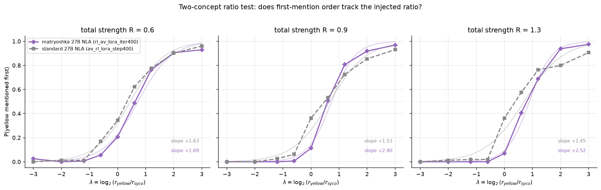

Inject `a = b + ||b||(r_y·v̂_yellow + r_s·v̂_syco)` into 40 neutral base
activations; sweep λ = log₂(r_y/r_s) over [−3, 3] at three total strengths;
judge every line 3-way for both traits (Claude Haiku, rubric identical to the
v3 study); read out P(yellow mentioned first). The matryoshka model's
first-mention order tracks the injected component ratio as a steep logistic
(slopes +1.69/+2.40/+2.52, floor ≈0, ceiling ≈0.95, n≈720/panel, 0 judge
failures): it *ranks* concepts by their share of the injection across a
64-fold ratio range.

**Departure from the 7B result:** unlike v3-vs-kitft (where the baseline was
flat), the standard 27B model ALSO orders by ratio (slopes +1.63/+1.53/+1.45)
— the matryoshka model is steeper at moderate/high strength and saturates
cleanly where the standard flattens mid-curve, but the separation is much
smaller than at 7B. Plausible reading: a stronger base model spontaneously
verbalizes the dominant component of a mixture first; ordering training
sharpens rather than creates the capability. The v3 word-chunk control (re-judging every
generation as 10 equal word chunks — identical order resolution for both
models) CONFIRMS and sharpens this: slopes rise for both (mat +1.94/+2.50/+2.66,
std +1.88/+1.77/+1.98), so the standard model's ordering is real and the
line-based readout was noise-penalizing it. Matryoshka training adds a
moderate slope advantage (~+0.5-0.7 at R≥0.9) rather than the capability.

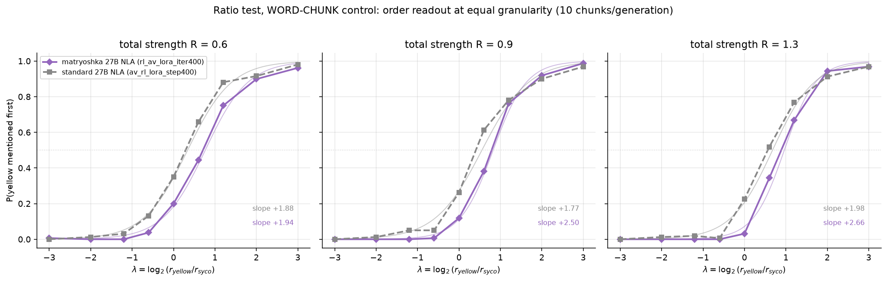

## Clean held-out marginal FVE (contamination fix)

The eval set used above (`av_eval.parquet`) draws 100% of its docs from
Ultra-FineWeb indices 0–99924 — **inside the 0–100k range the NLA corpus was
built from**, so it is not provably disjoint from training. To eliminate any
train/eval overlap, these figures re-extract fresh Qwen3.6-27B L42 activations
from **Ultra-FineWeb-en docs at index 300000+** (far past the training range),
sampling one prefix position ≥50 per doc, then run the matryoshka round-trip
(no gold needed: FVE = 1 − MSE(reconstruction, extracted)/var).

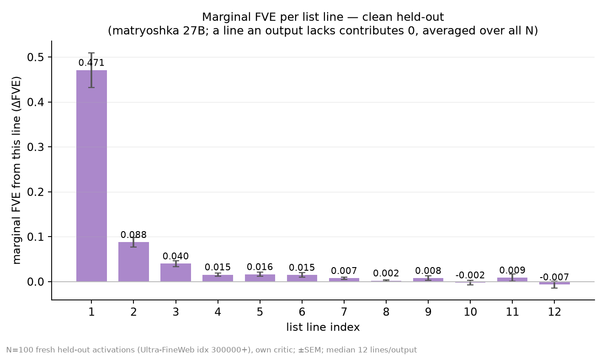
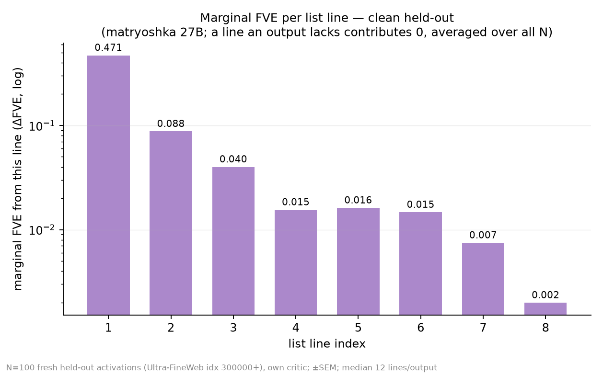
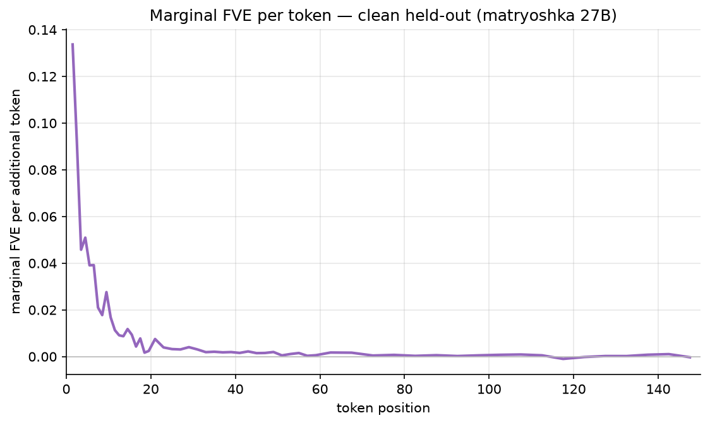

Result: the frontloading signature is **robust to the fix** — full-length FVE
0.662 (vs 0.657 on the contaminated set), line-1 marginal 0.471 ± 0.039 (vs
0.508). Contamination inflated line 1 by ~7% relative but changed nothing
qualitative; the first line still carries ~71% of full-explanation FVE on
genuinely unseen documents.

Per-line marginals use the unbiased definition: line k's marginal is averaged
over **all** N outputs, and an output that doesn't have a k-th line contributes
0 (a nonexistent line adds nothing to reconstruction) — not filtered to the
subset long enough to have it. The per-line marginals sum to 0.661 ≈ the
full-length FVE 0.662, confirming a proper decomposition. (Outputs run ~12
lines each since the model rarely emits EOS, so lines 1–10 have 98–100%
coverage regardless; the fix matters only for the near-zero tail.) Data: `results/clean_{fve_by_line.json,token_fve.csv,lines_fve.csv}`.

Same clean held-out data binned by token groups instead of lines (aggregate
population marginal; sums to full-length FVE 0.662):

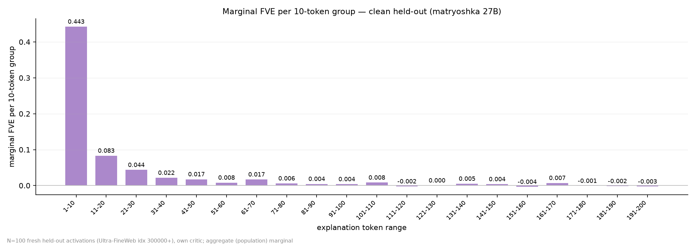
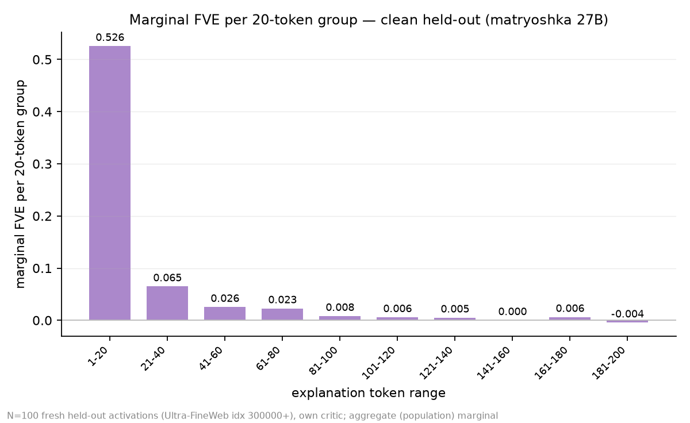

(log-y variants: `clean_mat_marginal_fve_{10,20}tok_LOGY.png`.)

## KL vs reconstruction contribution during RL

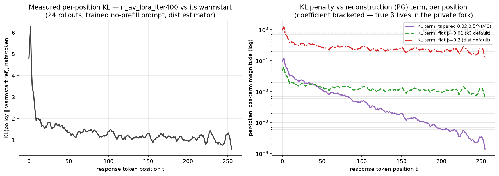

Measured offline from the released checkpoints (no wandb): per-token
`truncated_dist_kl(iter400 ‖ warmstart)` over 24 training-faithful rollouts,
compared to the GRPO policy-gradient term's scale (|A|≈0.80/token — advantages
are group-normalized). The policy moved most at the *start* of the response
(~6 nats/token in the first 5 positions vs ~1.1 late) — where matryoshka
training pays. Under every plausible coefficient (tapered 0.02·0.5^(t/40),
flat β=0.01, flat β=0.2) the KL term stays below the PG term at essentially
every position: reconstruction dominated the run's gradient (KL share of loss
magnitude ≈1.2% / 1.7% / 26% respectively). Caveats: converged-policy
measurement; the true β/taper lives in the training fork; rollouts use
training-range activations — appropriate here, since the quantity measured is
training-time policy divergence.

## Frontloading under single-trait steering (final, corrected protocols)

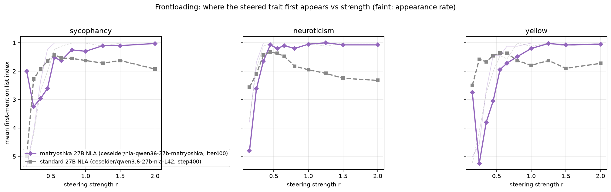

Genuine trait directions, 11-point strength grid x 3 traits x 40 neutral
bases, no prefill. Spearman(strength, first-mention index): matryoshka
**−0.578 / −0.570 / −0.537** (yellow/neuroticism/sycophancy) — the steered
trait moves to the top of the list as strength rises; standard +0.25 / +0.39 /
+0.03 — detection without reordering.

## Cross-critic FVE (co-adaptation control)

Both AVs' clean-held-out explanations scored through all four critics
(`results/crosscritic.json`, full-length FVE):

| AV \ critic | mat-RL | mat-WS | std-RL | std-WS |
|---|---|---|---|---|
| matryoshka | **0.675** | 0.554 | 0.596 | 0.390 |
| standard | 0.296 | 0.546 | **0.743** | 0.664 |

Matryoshka explanations are far more critic-portable: −0.08 FVE through the
*other* RL critic, vs the standard AV's −0.45. Much of the standard pair's
higher own-critic ceiling is a private co-adapted code; through the neutral
mat-warmstart critic the two AVs tie (0.554 vs 0.546).

## Predicting model behavior from the explanation alone

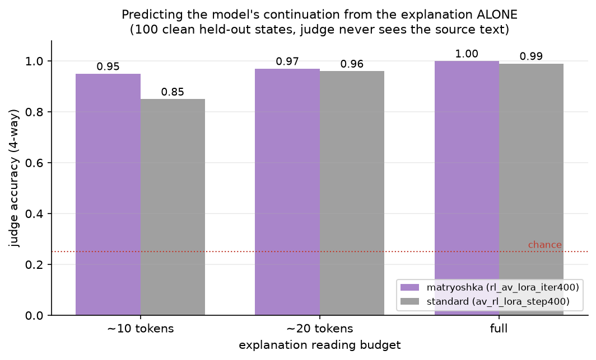

The interpretability-utility test: a judge sees ONLY the explanation (never
the source) and picks the model's true continuation among 4 candidates
(chance 25%; 100 clean held-out states). Both AVs are highly informative at
full length (0.99–1.00). At a ~10-token reading budget the matryoshka
explanation still identifies the model's behavior at **0.95** vs the
standard's 0.85 (3x the error rate) — frontloading converts to reading
efficiency, not just critic-FVE. (`results/behavior_acc.json`.)

## Sample sets (same 12 rows throughout; av_eval — training-range docs)

Note: sample rows come from `av_eval` (Ultra-FineWeb 0–100k, the training
range), so quoted per-sample MSEs are training-adjacent; treat these files as
qualitative. All quantitative FVE figures above use the clean held-out set.

- `matryoshka_samples.md` / `matryoshka_samples_fve.md` — the model of
  interest, with per-sample FVE, source-text tails, and standard-model
  reference outputs.
- `step400_corrected_samples.md` — the reference model under its tag protocol.

Notable quirks (both real model behavior, not harness): the matryoshka model
leaks CJK on ~12% of gold-activation generations and ~30% under steered (OOD)
activations; the standard model's unprefilled first token collapses to `<`
(orphaned SFT-era tag residue).

## Related: hallucination vs marginal FVE (separate experiment)

See `../qwen3.6-27b-halluc-marginal/RESULTS.md`. Mining the matryoshka's top-3
items with **negative marginal FVE** (272 items, 149/250 clean contexts) and
matching each to the standard NLA's corresponding sentence: 85% of matched
standard sentences have *positive* marginal (mean +0.42) and are load-bearing
(solo +0.25, LOO damage +0.09) where the matryoshka item is redundant/harmful —
the two critics assign the same claim opposite reconstruction roles (the
per-claim face of the cross-critic co-adaptation in the table above). Caveat:
negative marginal is a *weak* hallucination detector (n.s. for matryoshka, OR
1.18 p=0.19; weak for standard, OR 1.24 p=0.001) — most hallucinated items still
carry positive marginal. Base hallucination rate 39% (mat top-3) vs 54% (std
sentences); matched std sentences hallucinated 57%. Judge: nex-agi/nex-n2-mini.
