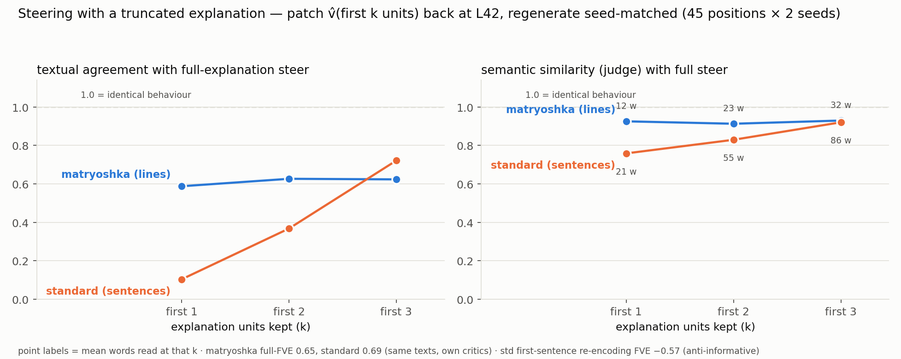

# Truncated-explanation steering + ablation rerun: matryoshka vs standard (fresh box, 2026-07-18)

Two questions, one RunPod A100 80GB (secure cloud, $1.39/hr; provisioning recipe
now in `~/ENV.md` §3B): (1) does the deletion-robustness ("sentence ablation")
result reproduce on fresh hardware, and (2) **how much better does the
matryoshka NLA steer when you keep only the first k explanation units** — the
truncation use-case the matryoshka structure exists for. Scripts:
`loo_precompute.py` / `std_loo_precompute.py` (unchanged), `steer_trunc.py` +
`judge_steer.py` + `plot_steer_fidelity.py` (new).

## 1. Ablation rerun — reproduces to 3 decimals

Full recomputation (gold L42 re-extracted, all ~186k critic scorings redone,
same precached verbalizations) on different silicon than the original A100:

| per deleted unit | matryoshka (line) | standard (sentence) |
|---|---|---|
| median damage (FVE lost) | **0.0049** | 0.0271 |
| p90 damage | 0.0338 | 0.1721 |
| free deletions (d<0.01) | **64.9%** | 31.1% |
| deletions destroying ≥0.05 more than the unit carried | **1.8%** | 25.2% |
| zero-credit units destroying >0.05 | **0.7%** | **19.5%** |

Buried lede likewise: first unit alone FVE-positive **93.7%** (mat, mean +0.294)
vs **2.0%** (std, mean −0.536); most-informative unit is first 67.6% vs 2.4%.
Every headline in `MATRYOSHKA_VS_STANDARD.md` §0–1 confirmed (19.6→19.5%,
25.1→25.2% are the only drifts; bf16/hardware noise). Fresh `loo.json`s were
regenerated on-box; sanity mismatch vs precache FVE >0.02 at only 44/5275 (mat)
and 22/5274 (std) positions.

## 2. Truncated steering — the new result

Protocol (`steer_trunc.py`, per position): extract the true L42 activation with
the raw base; take the model's own precached explanation; re-encode the **first
k units** with the model's critic; norm-match to ‖v‖; patch at the clicked
position; regenerate 60 tokens seed-matched at T=1 (2 seeds). Fidelity = does
the k-steer reproduce the **all-units steer** (same seed, only the vector
differs)? 45 positions spread over the 5 precache texts (≥60 tokens context,
both models ≥3–4 units), 720 continuations. Judged two ways: position-aligned
token agreement (mechanical; identical vectors ⇒ identical text) and a
0–3 semantic rubric via **nex-agi/nex-n2-mini** (OpenRouter), scaled to 0–1.
Both-empty continuations count as agreement 1, one-empty as 0 (8% of gens are
empty at these mid-document positions).

| k kept | words read | mat textual | std textual | mat semantic | std semantic | mat FVE(v̂ₖ,v) | std FVE(v̂ₖ,v) |
|---|---|---|---|---|---|---|---|
| 1 | 12 vs 21 | **0.588** | 0.103 | **0.925** | 0.759 | **+0.449** | **−0.573** |
| 2 | 23 vs 55 | **0.626** | 0.367 | **0.913** | 0.830 | +0.571 | +0.039 |
| 3 | 32 vs 86 | 0.623 | 0.721 | 0.930 | 0.920 | +0.605 | +0.524 |

(Textual-identical rates at k=1: 42% of matryoshka continuations are
byte-identical to the full steer; 9% for the standard.)

**Reading:** steering with just the FIRST unit, the matryoshka NLA reproduces
the full-explanation steer at 0.59 textual / 0.93 semantic — its opening line
re-encodes to cos 0.95 with the full reconstruction (FVE +0.45). The standard's
first sentence is **anti-informative** (FVE −0.57, worse than patching the
population mean): its truncated steer sends the model somewhere unrelated
(textual 0.10). It needs 3 of its ~4.3 sentences — **74% of the explanation,
86 words** — to match what matryoshka delivers with 1 line (10% of its
explanation, 12 words). At a matched ~22-word reading budget: 0.63 vs 0.10,
a 6× gap. The standard's k=3 crossing is not a win: 3 units is nearly its
whole explanation, while matryoshka's k=3 still omits 70% of its lines.

Caveats, stated plainly: 2 seeds × 45 positions (n=90/cell) — the k=1 gap is
~9σ by binomial SE on identical-rate, not a power issue, but per-position
variance is real; the semantic judge is lenient (shared 60-token prompt context
keeps topics adjacent, floor ≈0.76); fidelity-to-full-steer is the right target
for *truncation* but says nothing about whether the full steer itself is good
(both models' full re-encodings steer comparably — that's the prior
`surgery_findings.md` result). Positions are training-range precache texts.

## Provenance

- Box: RunPod secure-cloud A100 80GB PCIe (`dqo982gjgukfg4`), image
  `runpod/pytorch:0.7.0-cu1263-torch271-ubuntu2404`, venv: torch 2.7.1+cu126,
  transformers 5.5.4, peft 0.19.1, fla 0.5.1 + **causal-conv1d 1.6.2.post1
  built `--no-build-isolation`** (without it the qwen3_5 forward silently runs
  on CPU — see ENV.md §10).
- Wall-clock: ablation ~2h (28–29 critic scorings/s), steering ~50 min.
- Raw artifacts: `results/st_surgery.json` (720 continuations + per-k cos/FVE),
  `results/steer_fidelity.json` (aggregates). Fresh loo.json / acts checkpoints
  live on the box (`/root/evalsuite/`, `/root/loo_work_*`) — not committed
  (float-noise duplicates of the tracked ones).
