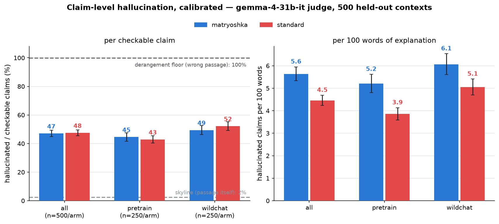
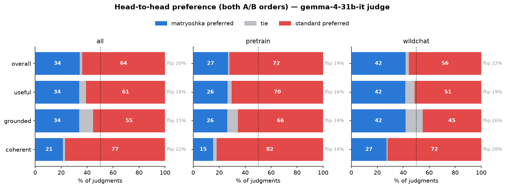
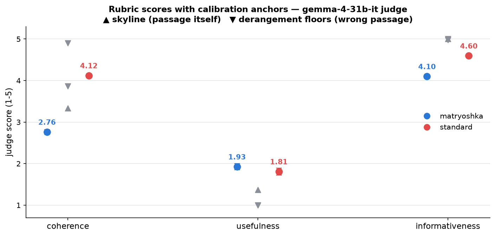

# Explanation quality: matryoshka vs standard 27B NLA, LLM-judged

**Question.** On broad held-out data, how useful are the two NLAs' explanations,
how much do they hallucinate, and how coherent are they — judged at the claim
level with calibration controls?

**Data.** 500 held-out contexts, one activation each (t ~ log-uniform[96,600],
L42, clean base): 250 Ultra-FineWeb-en docs (shard part-2002, disjoint from
training and all prior evals) + 250 WildChat conversations (evalsuite
`control_convos.json`, Qwen chat template). One T=1 explanation per context per
arm, pinned Space protocols (`gen_expls.py`, A100). Each context stores a
100-token true continuation so predictive claims are checkable.

**Judge.** `google/gemma-4-31b-it`, **pinned to CoreWeave/bf16**
(`allow_fallbacks: false`) — unpinned OpenRouter routing mixes ~18 providers
across bf16/fp8/fp4, an uncontrolled confound. The intended default judge
(`nex-agi/nex-n2-mini`) was degraded to ~2 tok/s with upstream 524s on the day
of the run (sole provider); its 990 completed absolute calls are cached and the
full nex replication can be run later with
`python judge_quality.py` (per-judge caches/outputs — nothing is shared).
3,500 calls total, 1 unparsed, ~$2.

Per explanation the judge enumerates the *smallest checkable claims*, labels
each `SUPPORTED / PREDICTIVE / PREDICTIVE_UNVERIFIABLE / UNSUPPORTED /
CONTRADICTED / META / RESTATE`, and scores coherence / usefulness /
informativeness 1–5. Hallucination = UNSUPPORTED+CONTRADICTED over checkable
(SUPPORTED+PREDICTIVE+UNSUPPORTED+CONTRADICTED). Calibration arms through the
same pipeline: **skyline** (the passage's own tail as the "explanation") and
**derangement floors** (context *i* judged against *i+1*'s explanation,
within-domain). Paired probe: both A/B orders per context.

## 1. Hallucination per checkable claim: a dead tie — and high

| leg | halluc/checkable (all) | pretrain | wildchat |
|---|---|---|---|
| **matryoshka** | **47.0%** [44.8, 49.3] | 44.6% | 49.4% |
| **standard** | **47.5%** [45.4, 49.5] | 42.8% | 52.2% |
| skyline (passage itself) | 2.5% | 0.0% | 6.2% |
| derangement (wrong passage) | 99.8% | 99.9% | 99.7% |

The paired per-context difference is **−0.005 [−0.026, +0.017]** — no
detectable accuracy difference per claim. The controls bracket the judge
tightly (2.5% false-positive floor, ~100% sensitivity ceiling), so the ~47% is
signal, not judge noise — and it replicates the ~47–54% "loose" rate the nex
judge assigned these same models on the suffix-eval corpus
(`../qwen3.6-27b-halluc-marginal`). With ~14–19 claims per explanation,
**~97–99% of explanations contain at least one hallucinated claim** in both
arms.

Per **100 words**, the matryoshka carries more hallucinations (5.6 vs 4.5,
paired diff +1.18 [+0.90, +1.47]) — but it also packs more claims per 100 words
(15.9 vs 12.5; the segmentation-parity diagnostic). Same error *rate*, higher
claim (and error) *density*.

Label mix (all claims): mat = 26% UNSUPPORTED / 10% CONTRADICTED / 17%
SUPPORTED / 21% PREDICTIVE / 13% RESTATE / 10% META; std = 21% / 15% / 13% /
25% / 11% / 14%. The matryoshka errs by *fabricating specifics*, the standard
slightly more by *contradicting*; the matryoshka restates the passage tail a
bit more, the standard makes more prediction-claims.

## 2. Head-to-head: the judge prefers the standard — mostly on style

Overall preference (both orders, n=1000 judgments): **standard 64% vs
matryoshka 34%**. But the breakdown matters:

- **coherent: 77 vs 21** — the biggest gap by far. Despite explicit
  format-neutrality instructions, prose beats telegraphic list fragments on
  "well-formed writing", and the absolute scores agree (std 4.12 vs mat 2.76 —
  and the *deranged* std explanation still scores 4.91, confirming coherence is
  pure style, independent of content).
- **grounded: 55 vs 34** — smaller, and inconsistent with the claim-level tie
  (§1). With a 15–22% order-flip rate, the pairwise "grounded" verdict looks
  style-contaminated.
- **wildchat is close to a tie** (overall 56 vs 42, grounded 45 vs 42) while
  pretrain is lopsided (72 vs 27) — the matryoshka is relatively strongest on
  chat-format data.

## 3. Rubric scores and what the anchors reveal about them

Usefulness: mat 1.93 vs std 1.81 (paired diff **+0.12 [+0.04, +0.19]**, the
matryoshka's only absolute win) — opposite in sign to the pairwise usefulness
preference (61 vs 34 for std). Informativeness: std 4.60 vs mat 4.10.

The anchors expose scale problems: the skyline (a verbatim passage tail —
maximally faithful) gets usefulness **1.37**, barely above the derangement's
1.00, and the derangements score informativeness **~5.0** — the judge reads
"informativeness" as pure specificity (as designed) but reads "usefulness" as
demanding explicit next-text prediction, compressing everything into 1–2.
Treat the 1–5 scales as ordinal-within-judge; the claim-level rates (§1) and
the calibrated bracket are the load-bearing numbers.

## Takeaways

1. **Accuracy per claim is indistinguishable** between the two NLAs (~47%
   hallucinated of checkable claims) — the matryoshka's coarse-to-fine format
   neither costs nor buys per-claim faithfulness on broad held-out data.
2. **Both models hallucinate constantly** at T=1: essentially every
   explanation contains fabricated or contradicted specifics. NLA explanations
   are topic/gist-reliable (far from the derangement floor) but not
   fact-reliable.
3. **The standard's preference win is mostly fluency.** The coherence gap
   (4.12 vs 2.76; 77/21 pairwise) dominates the overall verdict; on
   groundedness the claim-level data says tie, and on usefulness the absolute
   scores slightly favor the matryoshka.
4. **Domain matters:** the matryoshka is at its relative best on WildChat
   transcripts (near-tie overall) and weakest on pretraining prose.

## Caveats

- Single judge so far; format is unblindable (the judge can identify the arm
  from style, and the coherence results prove style leaks into preferences).
  The nex-n2-mini replication should be run when its provider recovers; the
  per-judge cache already holds 990 of its absolute calls.
- One rollout per context per arm at T=1; arm means confound rollout luck with
  model quality (paired design + n=500 mitigates).
- 100-token continuations: far-ahead predictions land in
  PREDICTIVE_UNVERIFIABLE (excluded from rates; ~2–3% of claims both arms).
- The mat arm is line-capped at 10 lines / 256 tokens (pinned protocol); its
  tail-heavy speculation is partially truncated relative to an uncapped run.

Scripts: `build_docs.py` (manifest), `gen_expls.py` + `run_box.sh` (A100
generation), `judge_quality.py` (swappable judge: `--judge`, `--provider`,
per-judge caches), `analyze_quality.py` (calibrated stats, cluster bootstrap),
`plot_quality.py`.
