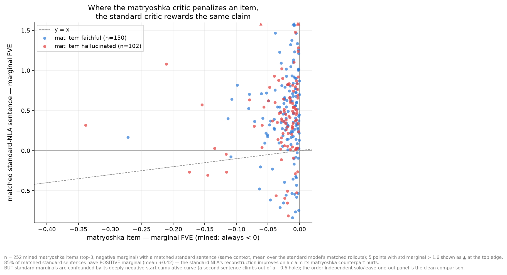
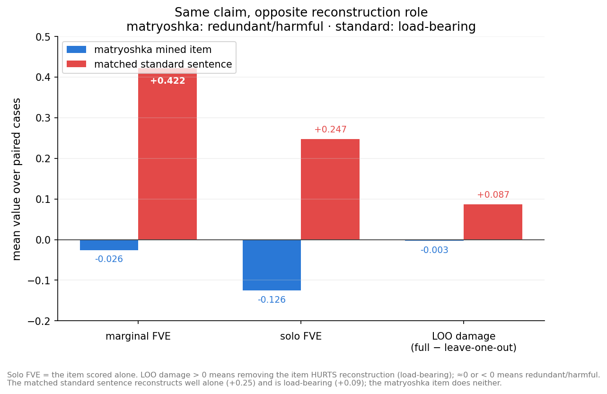
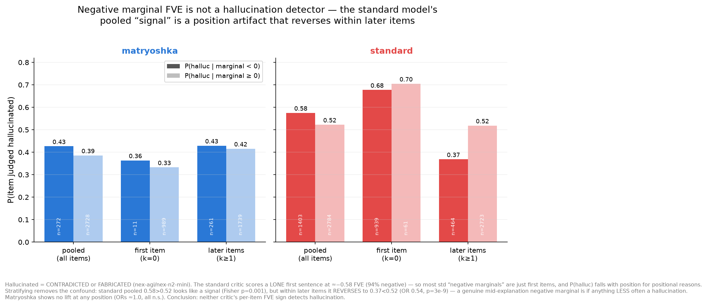
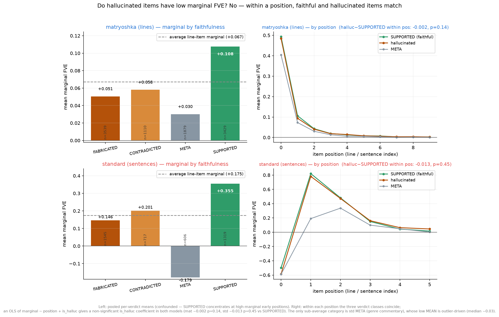
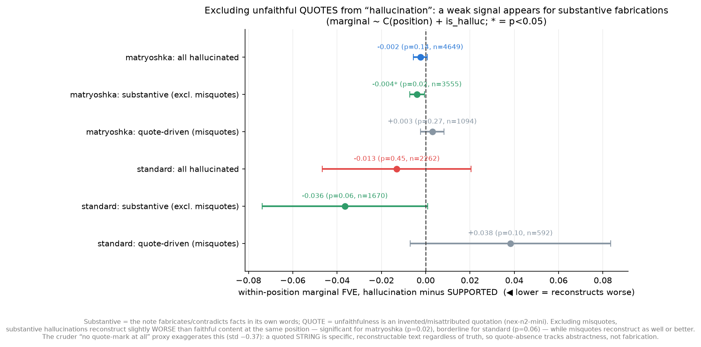

# Hallucination vs marginal FVE — matryoshka vs standard 27B NLA

**Question.** When one of a matryoshka NLA explanation's top-3 items has a
**negative marginal FVE** (adding it makes the critic's reconstruction *worse*),
(a) is that item actually unfaithful to the source text, and (b) what marginal
FVE does the *corresponding* claim get in the standard (non-matryoshka) NLA?

**Models.** `ceselder/nla-qwen36-27b-matryoshka` (`rl_av_lora_iter400`) and
`ceselder/qwen3.6-27b-nla-L42` (standard baseline), each scored by its **own**
co-trained `rl_critic_step400`. Layer 42, d_model 5120, mse_scale √5120 ≈ 71.55.

**Data.** The suffix-eval corpus (`../qwen3.6-27b-suffix-eval`): 250 clean
held-out Ultra-FineWeb-en contexts (tail shard, far outside training range),
one L42 activation each at token position t ∈ log-uniform[96, 600]. The two
models' explanations were already generated on the *same* activations (4 sampled
rollouts each). This experiment adds no generation — only critic scoring of
every explanation subset + an LLM faithfulness/matching pass.

**Unit.** Matryoshka items = its authored bullet lines (~10/expl). Standard items
= its `<explanation>` prose split into sentences (quote-parity splitter, byte-exact
reassembly — same as `std_loo_precompute.py`), ~4/expl. Marginal of item k =
FVE(items 1..k) − FVE(items 1..k−1). We also record **solo** (item scored alone)
and **LOO damage** (full − leave-one-out; > 0 means the item is load-bearing).

**Judge.** `nex-agi/nex-n2-mini` via OpenRouter. Each item is classified against
the source passage + true continuation as SUPPORTED / CONTRADICTED / FABRICATED /
META; hallucinated ≔ CONTRADICTED or FABRICATED. 0 unparsed across 8,275 calls.

## 1. Where the matryoshka critic penalizes a claim, the standard critic rewards it

Mining the matryoshka's top-3 items with marginal < 0 yields **272 items** (167
with marginal ≤ −0.01) across **149 of the 250 contexts**. For **252** of them the
standard model asserts the same claim in ≥1 of its 4 rollouts (matched by the
judge). Collapsing to one value per mined case (mean over matched standard
rollouts):

- **85%** of matched standard sentences have **positive** marginal FVE (mean
  **+0.42**) — the exact claims that hurt the matryoshka's reconstruction *help*
  the standard's.
- 20 mined items (7%) have **no** corresponding standard claim at all — the
  standard NLA simply never says it.

## 2. Same claim, opposite reconstruction role

The marginal gap is partly an artifact: the standard critic's cumulative FVE
climbs out of a deeply negative start (≈ −0.88 at 1 token; see the evalsuite
marginal-per-token figure), which inflates its early per-item marginals. So we
also compare the **order-independent** quantities on the 252 paired cases:

| metric (mean over 252 paired cases) | matryoshka mined item | matched standard sentence |
|---|---|---|
| marginal FVE | −0.026 | **+0.422** |
| solo FVE (item alone) | −0.126 | **+0.247** |
| LOO damage (load-bearing if > 0) | −0.003 | **+0.087** |

Even ignoring order: the matched standard sentence reconstructs well *by itself*
(+0.25) and is *load-bearing* (removing it costs +0.09 FVE; positive in 91% of
paired cases), while the matryoshka's item does neither — it reconstructs poorly
alone (−0.13; negative in 65% of paired cases) and removing it typically *helps*
(LOO damage ≈ 0). The two critics assign the same claim opposite roles. This is
the per-claim face of the cross-critic co-adaptation already seen in the
evalsuite (matryoshka explanations are critic-portable; the standard AV/critic
share a private co-adapted code). (All figures collapse each mined case to one
value, averaging over its matched standard rollouts; the 881 raw matches cover
708 distinct standard sentences, since one sentence can match several mined
items.)

## 3. Negative marginal FVE is *not* a hallucination detector (in either model)

The premise that "negative marginal ≈ critic-detected hallucination" does not
hold. The naive pooled comparison looks like a weak signal:

| pooled | P(halluc \| marginal<0) | P(halluc \| marginal≥0) | odds ratio | Fisher p |
|---|---|---|---|---|
| matryoshka (top-3) | 0.43 | 0.39 | 1.18 | 0.19 (n.s.) |
| standard (all sents) | 0.58 | 0.52 | 1.24 | 0.001 |

but the one apparently-significant cell — the standard model's p=0.001 — is a
**Simpson's-paradox position artifact**, not a critic signal. Two facts collide:
(i) the standard critic scores a *lone first sentence* at ≈**−0.58 FVE, 94%
negative** (its deeply-negative-start), so **67% of all standard "negative
marginals" are simply first sentences**; and (ii) P(hallucinated) falls
monotonically with sentence position (k=0: 0.68 → k=1: 0.60 → k=2: 0.51 → k=3:
0.42) for reasons unrelated to the marginal. Pooling the two manufactures a
correlation. Stratifying by position dissolves it — and for the standard model it
**reverses**:

| standard, by position | P(halluc \| marginal<0) | P(halluc \| marginal≥0) | odds ratio | Fisher p |
|---|---|---|---|---|
| first item (k=0) | 0.68 (n=939) | 0.70 (n=61) | 0.88 | 0.78 (n.s.) |
| later items (k≥1) | 0.37 (n=464) | 0.52 (n=2723) | **0.54** | **2.6e-9 (reversed)** |

A *genuine mid-explanation* negative marginal is, if anything, **less** likely to
be a hallucination. The matryoshka shows no lift at any position (odds ratio 1.15
at k=0, 1.06 at k≥1, both n.s.), so its pooled 1.18 is also compositional —
consistent with the n.s. label. A negative marginal means the critic couldn't
reconstruct better *given the item*, which happens for redundant, vague, or
position-0 items far more often than for unfaithful ones; the per-item FVE sign
carries no usable hallucination signal in either model.

What *does* differ is the base rate, independent of the marginal: **39% of
matryoshka top-3 items** are judged hallucinated vs **54% of standard sentences**
(and of the matched standard sentences specifically, **57%**). The standard
critic is not just tolerating the occasional fabrication — it rewards (§2) a claim
pool that is hallucinated more than half the time.

### 3a. Do hallucinated items have *low* marginal FVE vs the average? (all items)

Extending the faithfulness judge to **every** item (all 9,957 matryoshka lines —
not just top-3 — and all 4,187 standard sentences) and comparing each item's
marginal FVE to the average line-item marginal. **Answer: no — within a position,
faithful and hallucinated items have the same marginal FVE in both models.**

The *pooled* per-verdict means look like a signal but are position-confounded, so
the honest test is a regression `marginal ~ C(position) + is_halluc`, whose
`is_halluc` coefficient is the within-position effect (two-sided):

| | avg marginal | hallucinated mean | SUPPORTED mean | pooled halluc vs rest | within-position (OLS, halluc vs SUPPORTED) |
|---|---|---|---|---|---|
| matryoshka (lines) | +0.067 | +0.052 | +0.108 | p = 1e-9 | coef **−0.002, p = 0.14 (n.s.)** |
| standard (sentences) | +0.175 | +0.164 | +0.355 | p = 0.81 (n.s.) | coef **−0.013, p = 0.45 (n.s.)** |

**Matryoshka: the pooled gap is entirely position.** Hallucinated lines average
+0.052 marginal, below the +0.067 average and well below SUPPORTED (+0.108) — a
large pooled gap (p = 1e-9). But it vanishes under position control (OLS
is_halluc coef −0.002, p = 0.14): faithful and hallucinated lines trace the *same*
steep position curve (line 1 ≈ +0.48, decaying to ≈0 by line 5; right panel). The
pooled gap exists only because SUPPORTED content concentrates in the high-marginal
first line while hallucinations spread across the low-marginal tail — not because a
hallucinated line reconstructs worse *at its position*.

**Standard: no effect, pooled or controlled.** Hallucinated sentences (+0.164) sit
at the average (+0.175); pooled halluc-vs-rest is n.s. (p = 0.81), and
within-position vs SUPPORTED is n.s. (coef −0.013, p = 0.45). (One caution: a
regression against *rest* = SUPPORTED + META instead gives a spurious *positive*
significant coef, +0.046, p = 0.002 — driven entirely by META's low marginal
polluting the "faithful" baseline, not by hallucination. Comparing against
SUPPORTED-only removes it. This is why the pooled per-verdict bars are only
suggestive.)

So the answer is **no**: the raw ordering SUPPORTED (+0.36) > CONTRADICTED (+0.20)
> FABRICATED (+0.15) > META, and the low hallucination mean, are position/
composition effects — SUPPORTED clusters at early high-marginal positions. Within
a position the verdict classes are statistically indistinguishable. The only
sub-average category is standard-model **META** (genre/tone commentary the critic
can't reconstruct from) — and even there the low *mean* (−0.179) is outlier-driven
(median only −0.03; matryoshka META median is ≈0). Marginal FVE tracks
reconstruction usefulness and position, not unfaithfulness — consistent with §3.

### 3b. Excluding *unfaithful quotes* — a weak signal does appear

The judge lumps two failures under CONTRADICTED/FABRICATED: an invented or
misattributed **quotation** (a quoted string presented as being in the passage
but that isn't), vs a **substantive** fabrication of facts in the note's own
words. These behave oppositely under reconstruction — a fabricated *quote* is
specific, verbatim-looking text the critic reconstructs well regardless of truth.
Classifying every hallucinated item by *reason* (nex-n2-mini, QUOTE vs
SUBSTANTIVE) and redoing the within-position OLS vs SUPPORTED:

| | all hallucinated | **substantive (excl. misquotes)** | quote-driven (misquotes) |
|---|---|---|---|
| matryoshka | −0.002 (p=0.14) | **−0.004 (p=0.02)** | +0.003 (p=0.27) |
| standard | −0.013 (p=0.45) | −0.036 (p=0.06) | +0.038 (p=0.10) |

So **yes — excluding unfaithful quotes surfaces a real (if small) signal**:
substantive hallucinations reconstruct *worse* than faithful content at the same
position — significant for the matryoshka (p=0.02), borderline for the standard
model (p=0.06) — while misquotes reconstruct as well or better (positive coef).
The §3a "no signal" was the two subtypes canceling. The effect is small in
absolute FVE (mat −0.004; std −0.036), so it sharpens the mechanism rather than
yielding a usable detector.

**Caveat on operationalization.** A cruder "no quote-mark at all" regex proxy
shows a *much* larger apparent effect (std −0.37, p<1e-9), but that overstates it:
quote *presence* strongly predicts high marginal (a specific quoted string is
reconstructable text), so quote-*absence* tracks abstract/vague prose, not
fabrication per se. The LLM-reason split (does the unfaithfulness *consist of* a
misquote) is the faithful operationalization of the question and gives the honest,
smaller numbers above.

### 3c. Judge reliability — blind inter-rater check

A 68-item stratified sample (40 faithfulness, 28 quote-reason, both models, all
categories) was re-labeled by two independent reviewers **blind** to the
nex-n2-mini labels. Agreement:

| comparison | faithfulness (exact 4-way) | faithful vs hallucinated (binary) | QUOTE vs SUBSTANTIVE |
|---|---|---|---|
| nex vs reviewer A | 55% | 75% | 93% |
| nex vs reviewer B | 60% | 75% | 86% |
| reviewer A vs B | 78% | 85% | 93% |

Three things matter for the conclusions:

1. **The QUOTE vs SUBSTANTIVE split (which §3b rests on) is reliable** — nex agrees
   with each human as well as the humans agree with each other (~90%). The §3b
   decomposition is trustworthy.
2. **Faithfulness labels are noisier, but most of the gap is genuine rubric
   ambiguity, not judge error** — the two humans themselves agree exact-4-way only
   78%, and both independently flagged the *same* hard case: a note that correctly
   predicts the continuation but swaps one entity (does SUPPORTED's "predicts the
   continuation" clause beat CONTRADICTED's "misstates an entity"? the rubric
   doesn't specify precedence). META also sometimes absorbs vague-but-supported
   predictions.
3. **The residual disagreement is one-directional and conservative.** nex
   *over*-flags hallucination: 10-vs-0 (reviewer A) and 7-vs-3 (reviewer B)
   binary disagreements in the over-flag direction; 7 items both reviewers call
   faithful were marked hallucinated by nex, and **zero** the reverse. So the
   "hallucinated" bucket is, if anything, diluted with genuinely-faithful items
   (which reconstruct like SUPPORTED) — pushing its mean marginal *up* toward the
   faithful baseline and biasing §3a/§3b **toward the null**. The weak substantive-
   hallucination signal in §3b survives despite this, so the true effect is a lower
   bound, not an artifact of mislabeling. (Sample + both reviewers' blind labels:
   `results/judge_review_{sample,key,reviewerA,reviewerB}.json`.)

**Takeaway.** The requested comparison is clean and one-directional: matryoshka
items that damage its own reconstruction map to standard sentences that *improve*
the standard reconstruction, are load-bearing there (order-independent solo/LOO,
§2), and are themselves hallucinated a majority of the time. The standard
AV/critic pair reconstructs activations from surface features of a sentence
largely independent of the sentence's faithfulness. But the marginal *sign* is
not a hallucination detector for either model (§3) — the only significant-looking
cell was sentence position, not faithfulness — so this is a statement about the
two critics' reconstruction behavior on matched claims, not a lie-detector.

## Case studies

`results/cases.md` — the 20 strongest negative-marginal matryoshka items (CJK-
tainted items excluded from the case list; 4/272 mined items contain CJK and are
tallied separately). Each shows the source tail, the full matryoshka explanation
with per-item marginals, the judge verdict, and every matched standard sentence
with its scores. E.g. **ci=166**: on a passage about deep-brain stimulation for
Parkinson's, the matryoshka's item 2 is "AI-generated misleading medical article
about knee surgery" (FABRICATED, marginal −0.222, solo −0.445, removing it *helps*
by 0.036) — and the standard NLA makes no such claim there.

## Files / repro

- `score_subsets.py` — GPU: raw-base L42 extraction (norms cross-checked against
  the generation-time `act_norm`, median rel-diff 7e-8) + own-critic scoring of
  every pfx/solo/loo subset. Ran on 1× RunPod H200, ~30k + ~12.6k scorings,
  fla-accelerated (~67 jobs/s), resumable. → `results/subset_scores_{mat,std}.json`
- `analyze.py` — local: marginals, mining, the nex-n2-mini faithfulness sweep
  (all mat top-3 + all std sentences) and cross-model matching, report assembly.
  Cached per call. → `results/{analysis.json, judged_faithfulness.json, cases.md}`
- `plot_figs.py` → the three figures above.
- Own-critic scoring caveat carries over from the evalsuite: cross-model FVE
  *levels* are co-adapted; the comparison here is of each claim's role *within*
  its own model's reconstruction, which is the fair unit.

## Method audit (three independent reviewers)

The pipeline was re-audited after the first draft. Verified correct against the
raw data: the standard sentence splitter is byte-exact on all 1000 rollouts
(`''.join(units)==line`, `rebuild(all)=='\n'.join(lines)`), prefix nesting holds,
`solo[0]==pfx[0]` and `loo[n-1]==pfx[n-2]` identities pass on the shipped scores
(proving marginal/gold indexing is aligned end-to-end), the cross-model matcher
has zero indexing errors across all 881 matched rows (marginal, solo, and
sentence text all reconcile), and every headline number recomputes from scratch.
One real defect was found and **fixed here**: the earlier draft reported the
standard model's pooled P(halluc\|neg) lift (0.58 vs 0.52, p=0.001) as a "modest
real signal" — it is a Simpson's-paradox position artifact (§3, now corrected).
Guards added to `score_subsets.py` (finite-score assert, suffix-anchor cap
assert) since it carries no external FVE reference of its own.

§3a was then separately re-audited by three more independent reviewers (stats
validity, data/label integrity, adversarial). Data and labels passed clean: the
all-lines judge extension is complete (9,957 + 4,187 items, 0 missing/None), keys
were proven to index the exact judged text (400/400 cache-hash matches), per-verdict
means reproduce exactly, and a 16-item hand-check of nex-n2-mini verdicts found
16/16 defensible. The **core conclusion survived every adversarial attack**
(alternative confounds, tail/quantile views, per-position multiple-testing,
subgroup robustness, bottom-decile enrichment) — there is no within-position
hallucination signal in either model. But the reviewers flagged that the first
§3a *method* was unsound — a one-sided "detrend-then-Mann-Whitney" that (a) read
only the halluc<rest tail and (b) folded META into "rest", masking a real
(reverse-signed, META-driven) within-position effect for std. §3a was rewritten to
use the OLS `marginal ~ C(position) + is_halluc` coefficient (two-sided) and to
compare against SUPPORTED-only; the qualitative answer is unchanged and now rests
on a sound test. The "META is the only robust low-marginal category" framing was
also softened — its low mean is outlier-driven (median −0.03).
