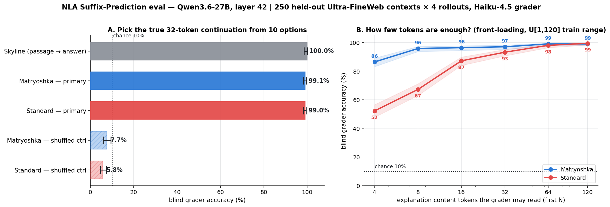
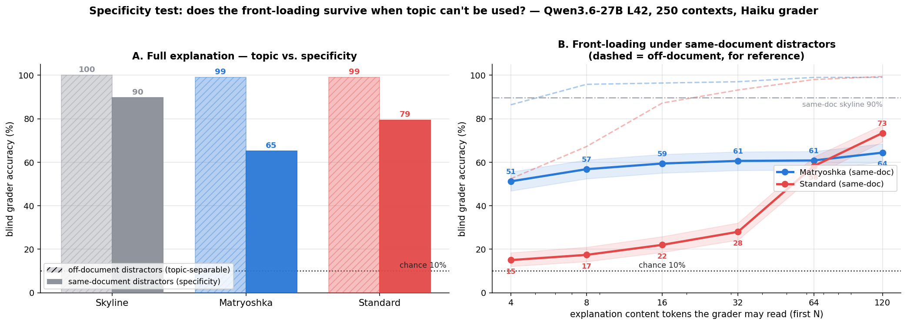
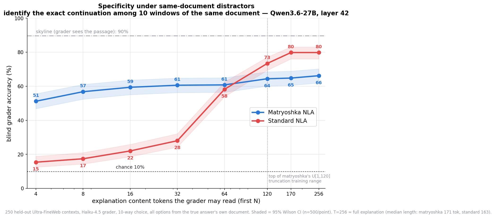

# NLA Suffix-Prediction eval — Qwen3.6-27B matryoshka vs standard

Reimplementation of the **Suffix Prediction** evaluation from Anthropic's
*Natural Language Autoencoders* (transformer-circuits.pub/2026/nla), run against
the released Qwen3.6-27B NLAs:

- **matryoshka** — `ceselder/nla-qwen36-27b-matryoshka` (`rl_av_lora_iter400`)
- **standard** — `ceselder/qwen3.6-27b-nla-L42` (`av_rl_lora_step400`), for comparison

**The metric.** Given the activation verbalizer's (AV) explanation of a
layer-42 activation at the *last token* of a truncated pretraining passage, a
blind LLM grader picks the true **next 32 tokens** from **10 options** (1 true +
9 off-document distractors). The grader sees only the explanation and the
options — never the source passage. Chance = 10%.

**What it does and does not measure.** Because the 9 distractors are drawn from
*other* documents (as in the paper), the true continuation is the only on-topic
option — so the grader needs the passage's **topic/domain**, not the specific
next 32 tokens. This is a topic/domain-separability task, not verbatim next-token
recovery: a hand-written 3–6 word topic label (no next-token content) already
scores ~100% on these items. Read the accuracies below as "how well the
explanation conveys the discriminative topic," and see *Validity* for a
specificity test that would go further.

## Method

- **Corpus:** `openbmb/Ultra-FineWeb` (en) — the models' *training* corpus, so
  the eval is in-distribution — drawn from the **tail shard** (`part-2001-of-2048`).
  **Held-out from NLA training — verified** (`check_heldout.py`): the warmstart
  corpus draws from the first ~100k Ultra-FineWeb docs (custom_id indices
  0–99,999, all in shard part-0000); checking all 250 eval-doc openings against
  every one of its 449,607 training rows found **0 genuine overlaps** (the single
  120-char hit was shared journal boilerplate between two different articles,
  8-gram Jaccard 0.035). The remaining, **unverifiable** caveat is the *base
  model*: Qwen3.6-27B's pretraining near-certainly overlaps FineWeb/CommonCrawl,
  so the base whose L42 activations we read has likely seen this web text — which
  would inflate absolute numbers (and could aid the specificity test via
  memorization) but hits **both** arms equally, leaving the matryoshka-vs-standard
  comparison intact. Read absolutes as in-distribution, not clean generalization.
- **Layer 42** (the 27B extraction layer; layer 20 is the 7B pipeline).
- **N = 250** contexts. Truncation position `t ~ log-uniform[96, 600]` capped to
  leave ≥32 tokens (median `t ≈ 244`). This **rejects the paper's [512,1536]
  window**: the 27B is meant to operate over short prefixes (the 7B pipeline's
  training prefixes were short, median a few hundred tokens — the exact 27B
  distribution isn't in-repo), so a training-realistic short window is the right
  operating regime rather than the sparse long tail. Applied identically to both
  arms. `prefix_ids` are stored verbatim so GPU-side extraction is immune to
  tokenizer-version drift.
- **Distractors:** random 32-token windows from other tail-shard docs — **off-
  document** by construction (as in the paper), which is what makes the task
  topic-separable (see *Validity*).
- **One fixed 10-way option set per context**, reused across rollouts and both
  models (it depends only on the true suffix + distractor pool, not any model),
  so the skyline validates items for both arms at once.
- **K = 4 rollouts** per activation (T=1 sampling); activations extracted once
  from the clean base and shared by both arms (bit-identical).
- **Inference protocols** pinned from the deployed Spaces: matryoshka = raw base
  + adapter, no prefill, plain bullet lines; standard = base + `av_sft` merged +
  RL adapter, `<explanation>\n` prefill, cut at `</explanation>`.
- **Grader:** Claude Haiku 4.5 via OpenRouter, paper-verbatim prompt.
- **Controls:** skyline (passage in place of explanation), shuffled-pairing
  (each explanation vs a deranged context's options, scored on the donor key),
  high-norm-outlier flag.

## Results — full explanation (saturated)

| | accuracy (95% Wilson CI) | majority-vote | inter-rollout agree | shuffled ctrl |
|---|---|---|---|---|
| **Skyline** | 100.0% [98.5, 100] | — | — | — |
| **Matryoshka** | **99.1%** [98.3, 99.5] | 98.8% | 99.5% | 6.7% |
| **Standard** | **99.0%** [98.2, 99.5] | 99.2% | 99.5% | 6.4% |

Chance = 10%; 0 norm-outliers. Both NLAs are **near-perfect** at full length —
the explanations convey the passage's topic well enough that the blind grader
picks the true continuation out of the off-topic distractors ~99% of the time.
The shuffled controls sit at/below chance, so the ~99% is real signal, not an
option-length/format cue; the 100% skyline confirms items are solvable (and, with
off-document distractors, trivially topic-separable). Because full-length is at
ceiling for both, it **can't differentiate** the models — that's in *how few
tokens* each needs.

*On the CIs:* the Wilson intervals above use n = 1000 (250 contexts × 4
rollouts), but the 4 rollouts share one activation and one option set and are
~perfectly correlated (design effect ≈ 3), so those intervals are ~1.7× too
narrow. The **honest unit is the majority-vote column (n = 250)** — e.g. the
matryoshka primary is really ≈ [96.5, 99.6], not [98.3, 99.5]. This widening
changes no conclusion (both arms are at ceiling; the budget gap below dwarfs it).

## Results — token budget (front-loading)

Accuracy vs. the number of **content tokens** of the explanation the grader may
read (first N). Tokens, not lines: the matryoshka is RL-trained on random-length
truncation of **U[1,120] content tokens**, so tokens are the unit the matryoshka
property is defined in, and "first N tokens" is comparable across the two arms
(which use different line granularities). n = 500/point (250×2 rollouts).

| content tokens | 4 | 8 | 16 | 32 | 64 | 120 |
|---|---|---|---|---|---|---|
| **Matryoshka** | **86.4%** | **95.8%** | 96.4% | 97.0% | 99.0% | 99.0% |
| **Standard** | 52.4% | 67.2% | 87.2% | 93.2% | 98.0% | 99.4% |

**The matryoshka front-loads the discriminative content.** With just **4 content
tokens** it is already at 86% (vs the standard's 52%); by **8 tokens** it is at
96% — effectively saturated — where the standard is at 67% and needs ~32–64
tokens to catch up. Both explanations are ~170 tokens long (median 171 mat / 163
std), but the matryoshka names the topic in its first few tokens while the
standard spends them on structural preamble ("Comparative educational
structure…", "Academic research paper…") before naming it. The two converge to
~99% by 64–120 tokens (the top of the training truncation range).

Given the topic-separability caveat, the precise claim is: **the matryoshka
conveys the passage's discriminative topic in far fewer tokens than the
standard** — not that it recovers the exact continuation sooner. The comparison
is fair (same token unit, identical grading, same fixed option sets), and it
independently confirms the matryoshka's designed front-loading through an
**external-grader** metric — orthogonal to the co-trained critic's FVE that the
model was optimised against, and consistent with the "buried lede" FVE result
(matryoshka leads with the informative unit; the standard opens with preamble).



## Validity

Reviewed adversarially (four independent passes over design, generation, grading,
and interpretation). The computation is sound — every number reproduces from the
cache, the Wilson formula is exact, extraction is the correct causal layer-42
convention with bit-identical activations across arms, and injection/protocols
match the deployed Spaces. Two things bound the *interpretation*:

- **Topic-separability, not next-token recovery (the main caveat).** Off-document
  distractors mean the true continuation is the only on-topic option, so the eval
  rewards conveying the passage's *domain*, not the exact 32 tokens. Direct probe:
  replacing every explanation with a bare 3–6 word topic label scores ~100%; the
  standard's register-only first 4 tokens still score 52%. So the off-document
  accuracies (and the front-loading curve above) measure **topic/register
  conveyance**. The specificity test below removes this shortcut.
- **Rollout clustering.** See the CI note above — lead with the n=250
  majority-vote intervals.
- **Grader robustness — checked with a second, unrelated grader**
  (`nex-agi/nex-n2-mini`, same-document eval re-graded in check mode: no
  shuffled control, 2 rollouts full / 1 rollout budget at 4 points;
  `results_hard_nex.json`, `budget_hard_nex.json`, `grader_check.png`). Every
  qualitative conclusion replicates: standard > matryoshka at full length
  (nex 92.6% vs 79.4%; Haiku 79.4% vs 65.1%), matryoshka dominates small budgets
  (nex T4 59.6% vs 15.6%; Haiku 51.2% vs 15.0%), and the crossover sits at
  ~64–120 tokens under both. nex is uniformly the stronger extractor (skyline
  93.2% vs 89.6%; everything shifts up ~10 pts) — absolute numbers are
  grader-relative, orderings are not.

## Specificity test — same-document distractors

Same eval, same explanations, but the 9 distractors are now **other
non-overlapping 32-token windows from the true answer's own document**
(`build_hard_options.py` → `data/hard_manifest.json`). Every option is on-topic,
so the grader can no longer win on domain — it must identify the *specific*
continuation after token *t*.

**Full explanation** (n = 1000 gradings/arm; same clustering caveat):

| | off-document | same-document | same-doc majority-vote | same-doc shuffled |
|---|---|---|---|---|
| **Skyline** | 100.0% | 89.6% | — | — |
| **Matryoshka** | 99.1% | **65.1%** | 70.0% | 12.6% |
| **Standard** | 99.0% | **79.4%** | 82.4% | 10.8% |

**Token budget, same-document** (n = 500/point; T=256 ≈ full explanation —
median lengths 171 mat / 163 std, so T=120 truncates essentially all of them):

| content tokens | 4 | 8 | 16 | 32 | 64 | 120 | 170 | 256 |
|---|---|---|---|---|---|---|---|---|
| **Matryoshka** | **51.2%** | **56.8%** | 59.4% | 60.6% | 60.8% | 64.4% | 64.8% | 66.2% |
| **Standard** | 15.0% | 17.4% | 22.0% | 28.0% | 58.2% | 73.4% | **79.8%** | **79.8%** |

Three findings:

1. **The off-document ~99% was mostly topic-matching.** With topic controlled,
   both arms drop hard (99→65 and 99→79) — but both stay far above chance (10%)
   and the shuffled controls return to ~chance, so the explanations do carry
   genuine continuation-specific information. Even the skyline falls to 90%:
   picking the exact next 32 tokens among same-document windows is hard.
2. **At full length the ranking reverses: the standard NLA is more specific**
   (79.4% vs 65.1%, a ~14-pt gap at n=250). The matryoshka's truncation-RL
   apparently trades total fine-grained specificity for early-token utility.
3. **Front-loading survives the topic control — dramatically.** At 4 tokens the
   matryoshka already delivers 51% (≈77% of everything it will ever deliver)
   while the standard is at 15%, barely above chance; the standard crosses over
   between 64 and 120 tokens — near the top of the matryoshka's U[1,120]
   training range — and keeps climbing to 79.8% by T=170 (its explanations run
   ~163 tokens, so T=120 still truncates them all) while the matryoshka plateaus
   (64→66%). So the crossover is the honest headline: **the matryoshka puts its
   (smaller) payload first; the standard buries its (larger) payload deep.** A
   monitor reading only the first few tokens should prefer the matryoshka; a
   reader of full explanations gets more specificity from the standard.




### Final-token-revealed variant (is the front-load just token-restating?)

The matryoshka's first lines often literally restate/complete the passage's
final token, a trivially front-loadable cue. Re-graded the same-document eval
with the judge additionally TOLD the final token (`grade_suffix_ft.py`,
`ft_results.json`, `ft_check.png`; token-only baseline = final token, no
explanation):

| | token only | T=4 | T=8 | T=32 | T=120 | T=256 | full |
|---|---|---|---|---|---|---|---|
| **Matryoshka + token** | — | 51.6% | 53.6% | 59.2% | 64.0% | 66.0% | 67.4% |
| **Standard + token** | — | 27.6% | 28.0% | 36.8% | 73.2% | 75.6% | 76.8% |
| **Final token alone** | **32.8%** | | | | | | |

- **~1/3 of the matryoshka's early edge was token-restating; ~2/3 survives.**
  At T=4 the gap was +36 pts without the token, +24 with it. The matryoshka's
  4 tokens still beat the token-only floor by +19 pts — genuine semantic
  front-loading beyond the last token.
- **The matryoshka's curve barely moves** (±3 pts at every budget): the token
  was already redundant with its opening lines. The standard's low-budget
  points jump ~+10 to ≈ the token-only floor (its register-preamble adds
  nothing beyond the token until ~T=32; at T=4–8 it's even slightly *below*
  token-only — a truncated preamble mildly distracts the judge).
- The full-length specificity reversal is unaffected (std 76.8 vs mat 67.4).

**Grader comparison** (`ft_results_nex.json`, `ft_graders.png`): under
nex-n2-mini the token-only floor doubles (67.2% vs Haiku's 32.8% — a much
stronger cue-exploiter), yet the same structure holds: matryoshka's low-budget
lead persists (T=4 gap +15 pts; Haiku +24; no-token +36), and the standard's
truncated preamble again sits at/below its token-only floor until ~T=32.
One nex-specific nuance: at full length with the token revealed the reversal
compresses to a statistical tie (mat 90.6 vs std 92.4, both near nex's 93.2
skyline) — the token is fully redundant for the standard at full length
(92.6→92.4) but complementary for the matryoshka (79.4→90.6), i.e. much of the
matryoshka's full-length specificity deficit is exactly the token-adjacent
detail it omits and the standard spells out.

## Caveats

- Held out from NLA training (verified, `check_heldout.py`); base-model
  pretraining overlap is separate and unverifiable (see *Corpus*).
- Grader is Haiku 4.5; a stronger/weaker grader would shift absolutes but not the
  matryoshka-vs-standard gap, which is a within-grader comparison.
- ~12.7% of matryoshka explanations (2.6% of standard) contain a stray CJK char —
  benign inline code-switching (a single on-topic Chinese word in otherwise-correct
  English), verified not to be injection failure; kept in, so the numbers include
  that realistic noise.
- The token-budget axis re-encodes the cleaned (stripped, blank-dropped) explanation
  text, so "first N tokens" is an ~faithful proxy for the model's emitted token
  boundaries, applied identically to both arms.

## Reproduce

```bash
# tokenizer (not committed): hf download Qwen/Qwen3.6-27B tokenizer* -> data/qwen_tok
python build_manifest.py                                    # local, CPU
# on a single H200 (transformers==5.5.4, peft==0.19.1, flash-linear-attention,
# torch 2.7.1+cu126): rsync repo + Space-vendored nla/, then
python suffix_gen.py --model mat --out results/explanations_mat.json
python suffix_gen.py --model std --out results/explanations_std.json
# local grading (needs ~/.openrouter_key):
python  grade_suffix.py --explanations results/explanations_{mat,std}.json
.venv-cpu/bin/python grade_budget.py --explanations results/explanations_{mat,std}.json
python  plot_suffix.py
# specificity test (same-document distractors; reuses the explanations, no GPU):
.venv-cpu/bin/python build_hard_options.py
.venv-cpu/bin/python grade_suffix.py --manifest data/hard_manifest.json \
    --explanations results/explanations_{mat,std}.json --out results/results_hard.json
.venv-cpu/bin/python grade_budget.py --manifest data/hard_manifest.json \
    --explanations results/explanations_{mat,std}.json --out results/budget_hard.json
python  plot_hard.py && python plot_reversal.py
# held-out check (eval docs vs the NLA training corpus):
.venv-cpu/bin/python check_heldout.py
```
